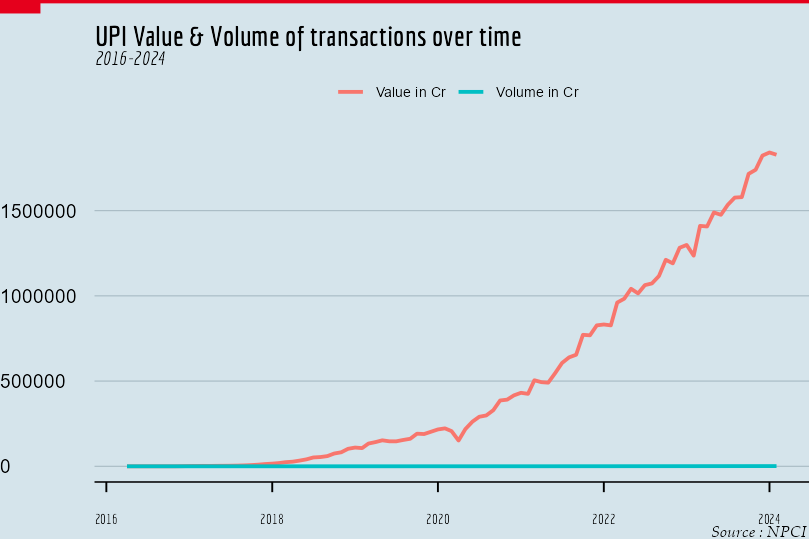
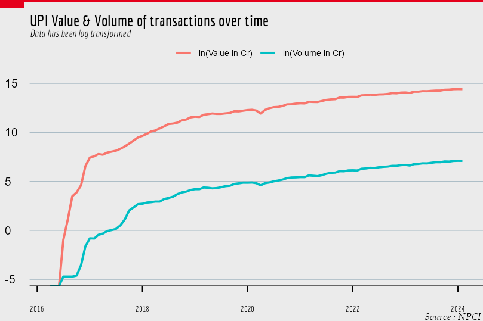

\allsectionsfont{\centering}
\subsectionfont{\raggedright}
\subsubsectionfont{\raggedright}

\pagenumbering{gobble}

\begin{centering}

\vspace{3cm}

```{r uni_logo, echo=F, out.width="20%"}

```

\vspace{1cm}

\Large
{\bf The University Of Calcutta}

\vspace{0.8cm}

\Large
{\bf Vivekananda College}

\vspace{1cm}

\Large

\doublespacing
{\bf A project on\\
Time Series Analysis Of India's UPI Growth}

\vspace{1 cm}

\normalsize
\singlespacing
By

\vspace{0.5 cm}

\Large

{\bf\href{https://www.linkedin.com/in/debaditya-chakroborty-a4aa4624b/}{Debaditya Chakraborty}}

\vspace{1cm}
Roll.No: 213544-21-0103\\
Reg.No: 544-1111-0507-21
\vspace{1.5 cm}

In partial fulfillment of the requirement \\
for the degree of B.Sc with Honours \\
in Statistics

\vspace{1.5 cm}

\normalsize
Submitted On- `r Sys.Date()`

\end{centering}

\newpage

\pagenumbering{gobble}
\newpage

```{=latex}
\setcounter{tocdepth}{2}
\tableofcontents
```
\newpage

```{r setup, include=FALSE}
knitr::opts_chunk$set(
	echo = FALSE,
	fig.align = "center",
	message = FALSE,
	warning = FALSE,
	cache = TRUE,
	dev = "ragg_png",
  dpi = 400,
	dev.args = list(png = list(type = "cairo")),
	out.width = "65%",
	out.height = "75%",
	fig.pos = "H")
```

```{r echo=FALSE, error=FALSE, message=FALSE, warning=FALSE}
#Loading Essential Libraries####
library(randtests)
library(kableExtra)
library(broom)
library(dplyr)
library(xlsx)
library(ggplot2)
library(tseries)
library(ggspectra)
library(ggfortify)
library(gt)
library(gtExtras)
library(ggthemes)
library(tidyr)
library(prettydoc)
library(hrbrthemes)
library(knitr)
library(gridExtra)
library(ie2misc)
library(zoo)
library(xts)
library(grid)
library(sysfonts)
library(showtext)
sysfonts::font_add("Economica","C:\\Users\\Debaditya\\AppData\\Local\\Microsoft\\Windows\\Fonts\\Economica-Bold.ttf")
```

# Keywords {#sec-keywords .unnumbered style="color: gray;"}

```{r}
text_tbl <- data.frame(
Acronym = c("UPI", "PSP", "MSME","NEFT","RTGS","IMPS","Aeps","CTS","AR(p)","MA(q)","ARMA(p,q)","ARIMA(p,d,q)","SARIMA","AIC","MAPE","MASE","P2M & P2P"),
Definition = c("Unified Payment Interface,A fast and secure digitial pyment system","Payment Service Provider,can be a bank or other institution","Micro and Small & Medium Enterprises","National Electronic Funds Transfer is an electronic funds transfer system maintained by the Reserve Bank of India","Real-time gross settlement systems are specialist funds transfer systems where the transfer of money or securities takes place from one bank to any other bank","Immediate Payment Service (IMPS) is an instant interbank electronic fund transfer service through mobile phones.","Aadhaar Enabled Payment System (AePS) is a banking service developed by the National Payments Corporation of India(NPCI)."," Cheque Truncation System is an online image-based cheque clearing system","Autoregressive Process of order  p","Moving Average Process of order q","Combination of AR & MA process of order p and q ","A more complex version of ARMA where d represents the order of differencing","ARIMA model that implements Seasonality","Akaike Information Criterion is a mathematical method for evaluating how well a model fits the data it was generated from","Mean absolute percentage error,this measures the average magnitude of error produced by a model, or how far off predictions are on average","Mean Absolute Scaled Error, A more reliable accuracy measure to compare different models.","Person to Merchant and Peer to Peer Payments")
)

kbl(text_tbl, booktabs = T) %>%
kable_styling(full_width = T,position = "center") %>%
column_spec(1, bold = T, color = "violet") %>%
column_spec(2, width = "30em") %>%
  kableExtra::kable_styling(latex_options = "HOLD_position")

```
\pagenumbering{arabic}
\newpage
# **Acknowledgements** {.unnumbered}

Firstly, I am profoundly grateful to **Prof. Nilkanta Mukherjee**, Head of the Department of Statistics, Vivekananda College, for his invaluable leadership and support. His insightful feedback and encouragement have been instrumental in shaping the direction of my research for the project.
I would also like to extend my heartfelt thanks to **Dr. Junaid Khan**, whose expertise and dedication provided me with the tools and confidence needed to navigate through complex statistical concepts.
A special note of appreciation goes to **Prof. Sutapa Biswas**, her detailed critiques and constructive suggestions significantly enhanced the quality of my work. Her guidance was crucial in helping me to refine my analysis and methodology.
I am also deeply thankful to **Prof. Riddhi Das Majumdar** for her continuous support and motivation.I am grateful to my alma mater, _Vivekananda College_ and the Department of Statistics, for providing a conducive academic environment and the necessary resources for my studies. 
Lastly, I would like to thank my friends, whose camaraderie and moral support have been indispensable. Their encouragement and understanding helped me stay focused and motivated during challenging times.This project report would not have been possible without the collective efforts and support of all these individuals.   
\hfill Thank you all.

\newpage

# **Abstract** {.unnumbered}

This paper presents a detailed analysis of the Unified Payments Interface (UPI) in India, focusing on its rapid adoption and transformative impact on digital payments from 2016 to 2024. The study employs advanced statistical techniques, including time series analysis, stochastic modeling, and forecasting, to investigate monthly and daily UPI transaction data. Key insights reveal significant trends in transaction volume and value growth, the influence of seasonal patterns, and the stabilization of average transaction values over time. The analysis also delves into the categorization of payments and merchant types, identifying sectors with the highest UPI adoption. Additionally, the paper addresses critical issues such as security concerns and transaction errors, offering a comprehensive overview of the challenges and prospects of UPI. Through rigorous data analysis, this study underscores UPI's pivotal role in enhancing financial accessibility and its potential to drive future innovations in India's digital economy. \newpage

# **Methodology** {.unnumbered}

1. Data Collection-

* Sources: Data for the project is secondary and has been collected via web scraping or downloadable files from [RBI](https://rbi.org.in/Scripts/Statistics.aspx) and [NPCI](https://www.npci.org.in/what-we-do/upi/upi-ecosystem-statistics) which are two government bodies, these are totally publicly available data and there are no underlying ethical issues.

* Time Period: The time period for which the data was collected is from 2016 to 2024 as per the latest release.

* Data Types: Data has been collected for monthly UPI transaction values, volumes, number of banks live in UPI, daily transaction volumes and values, payment categories, and merchant categories.

2. Data Reprocessing-

* Cleaning: The available data had many inconsistencies which had to be taken care .

* Transformation: To account for difference for volume and values log transformation has been used in some cases, monthly values  have also been aggregated to calculate business and transaction decline, etc.

3. Exploratory Data Analysis (EDA)

* Techniques Used: Since the data is Time Series plots have been done for different data sets that are used, although summary statistics aren't that useful for time series they still have been added.

* Tools: All of the visualizations have been done using the `ggplot` and base `graphics`  packages in `R`,additional customization were done using `ggthemes`, `hrbrthemes`, `ggextras` etc.

4. Time Series Analysis -  

* Monthly UPI Value and Volume Analysis:  
  Trend Fitting: For the monthly data used moving averages and logistic curves to fit the    data and check the general trend for the future.  

* Per Transaction Value Analysis:  
Forecasting Methods: Used forecasting techniques such as Holt-Winters, ARIMA, and exponential smoothing. to make predictions for future per transaction values.

* Monthly Growth Rate Calculation:  
Growth Rate Function: Built a function in  R to calculate the monthly growth rate.

* Forecasting Models: Used forecasting models such as ARIMA ,SES, Holt-winters to Make future predictions after finding a suitable framework.

5. Daily Time Series Analysis  
* Seasonality Handling: Explained the challenges faced due to monthly seasonality and how Fourier terms were incorporated into the ARIMA model to address these issues.

6. Exploratory Data Analysis for Payment and Merchant Categories  
* Payment Categories: Made charts to understand the distribution and trends in different payment categories over the months.

* Merchant Categories: Analyzed the presence of certain merchant categories in high and medium transaction range , identifying key sectors and their growth patterns.

7. Addressing UPI Issues  

* Security Concerns: Methodologies used to analyze security issues have been- literature review and  case studies.

* Decline Analysis:  Used available NPCI data to study declines in business and transaction volumes via basic EDA measures.

8. Software and Tools
Most of the project has been done using `R` infact the report itself has been generated using `Rmarkdown` . Excel has been used in some data sets(such as the daily time series) to incorporate with the available data ,some `python` scripts were used as well to combine some excel sheets . This was done for the ease of data handling.

_A list of used  `R` packages is added in the reference section._

\newpage
# **Introduction** {.unnumbered}

The introduction of UPI has revolutionized the digital space. UPI usage has exponentially increased since its inception in 2016, with its growth outpacing all other modes of digital payments. UPI is an instant, real-time payment network built, owned, and operated by the National Payments Corporation of India (NPCI). This payment system is built as an inter-operable protocol and allows third-party vendors to build apps to provide payments as a service to all customers of participating banks. Due to interchangeability, customers with an account in Bank "A" can use a payments app built by PSP "X" to send money from their account in one bank to self or other party accounts of any other bank or PSP participating in UPI via QR codes, mobile numbers, or other identifiers, with instant settlement of payments (NPCI, 2016). UPI is used by multiple stake Holders, including individuals, micro, small, and medium enterprises (MSMEs), and especially smaller merchants. It is easily accessible through mobile devices, provides convenient payment initiation methods, such as users registered mobile numbers, QR codes, etc., and ensures universal interperability between financial institutions. These design choices have helped enhance digital and financial literacy and included the portion of the population that was formerly underserved or unserved by financial institutions.

## Impact of UPI in India's Economy {.unnumbered}

In about eight years, India's indigenously developed UPI, has evolved into the default option to transact---from small ticket purchases at roadside shops to settling utility bills to restaurant bills, to now IPO stock purchases and mutual fund payments.

This transformation, which has now become a global template that many other countries are emulating, is founded on multiple edifices powered by a behavioral change among hundreds of millions.While UPI has made sending and receiving money at the tap of a mobile phone app, the bigger question is how has it added to India's broader economy? Importantly, what has been the specific incremental contribution of UPI or India's rapid digitization of payments to India's gross domestic product (GDP).The answer to this is two-fold. One is the opportunity cost. Two is through enabling easier credit-driven spending.

UPI has had a profound impact on financial access in India by enhancing the ease and convenience of digital transactions, especially for those who were previously underserved by traditional banking services. Here are several ways UPI has contributed to improving financial access:

1.  **Accessibility**: UPI can be accessed through smartphones, making it available to a wide range of individuals, including those in remote areas where traditional banking infrastructure is limited.

2.  **Inclusion of Unbaked Population**: UPI has facilitated financial inclusion by allowing unbaked individuals to open a bank account digitally and link it to UPI, enabling them to participate in digital transactions.

3.  **Simplified Transactions**: UPI simplifies the process of making payments and transferring money, even for those with limited literacy or familiarity with banking procedures, thus lowering the barrier to entry for digital financial services.

4. **Cost-Effective Transactions:** UPI transactions are often low-cost or free, making it an affordable option for individuals and businesses alike, which reduces the financial burden associated with traditional banking fees.

5. **Real-Time Transactions:** UPI enables instant, real-time transactions, which enhances the efficiency of financial operations for both consumers and businesses, allowing for quick and seamless money transfers.

6. **Security and Fraud Prevention:** UPI incorporates robust security measures such as two-factor authentication and encryption, which build trust among users and encourage the adoption of digital transactions by mitigating the risk of fraud.

7. **Integration with Various Financial Services:** UPI’s integration with multiple financial services, including mobile wallets, online banking, and third-party payment apps, provides users with a versatile and comprehensive digital payment ecosystem.

8. **Merchant Adoption:** The widespread adoption of UPI by merchants, ranging from small roadside vendors to large retail chains, has significantly expanded the acceptance of digital payments across various sectors, enhancing the overall digital economy.

9. **Support for Government Initiatives:** UPI supports government initiatives aimed at promoting digital payments and financial inclusion, such as the Direct Benefit Transfer (DBT) scheme, which directly deposits subsidies and benefits into recipients’ bank accounts.

10. **Enhanced Transparency:** By digitizing transactions, UPI promotes transparency in financial dealings, reducing the reliance on cash and helping to curb the shadow economy.

11. **Boost to Digital Literacy:** The widespread use of UPI has encouraged more people to become digitally literate, as they learn to navigate and utilize mobile banking apps and other digital financial services.

12. **Economic Formalization:** UPI contributes to the formalization of the economy by bringing more transactions into the digital space, which aids in better tax compliance and economic monitoring by the authorities.

13. **Financial Empowerment:** By providing a user-friendly and accessible platform, UPI empowers individuals to manage their finances more effectively, track their spending, and make informed financial decisions.

14. **Innovation and Competition:** The success of UPI has spurred innovation in the fintech sector, leading to the development of new financial products and services that cater to the diverse needs of the Indian population, fostering competition and improving service quality.

15. **Reduced Reliance on Cash:** UPI has significantly reduced the reliance on cash transactions, promoting a shift towards a cashless economy, which is more efficient and less prone to issues such as theft and counterfeiting.

\newpage 

# **Analyzing Monthly UPI Transaction(From 2016 to 2024)**

Here are the first few rows of the dataset, to get an idea of the -

```{r echo=FALSE, message=FALSE}
#loading the data set####
upi<-xlsx::read.xlsx(file = "C:\\Users\\Debaditya\\Documents\\Project_Work\\UPI_Analytics.xlsx" ,sheetIndex = 1)
#converting the data set to a data frame for ease#### 
upi<-as.data.frame(upi)
#reversing the order of rows since we want the data to begin from 2016-04####
data1<-as.data.frame(t(rev(as.data.frame(t(upi)))))
colnames(data1)<-c("Month","No. of Banks live on UPI","Volume(In Mn)","Value(In Cr)","Volume(In Cr)")
kable(head(data1,n = 20), "latex", longtable = T, booktabs = T,caption = "Monthly UPI Metrics") %>% kable_styling(latex_options = c("striped", "scale_down")) %>%
  kableExtra::kable_styling(latex_options = "HOLD_position") %>%
  kableExtra::kable_styling(latex_options = "HOLD_position")

```

Only the first 10 rows are shown for convenience.The volumes have been converted to crore from million.

```{r}
val_time<-ts(data=as.numeric(data1$`Value(In Cr)`),start = c(2016,4),end=c(2024,2),deltat = 1/12)
vol_time<-ts(data=as.numeric(data1$`Volume(In Cr)`),start = c(2016,4),end=c(2024,2),deltat = 1/12)
per_trans<-ts(data=val_time/vol_time,start = c(2016,4),end = c(2024,2),deltat=1/12)
bank_num<-ts(data=as.numeric(data1$`No. of Banks live on UPI`),start=c(2016,4),end=c(2024,2),deltat = 1/12)
```

## Exploratory Analysis
```{r fig.cap="Plot showing the growth of Upi Transaction volume and Transaction amount overtime(2016-2024)"}

```

```{r echo=FALSE, warning=FALSE,eval=FALSE,fig.showtext=TRUE}

ggplot()+
  geom_line(data = upi,mapping = aes(x=upi$Month,y=upi$Value..in.Cr..,color="Value in Cr"),linewidth=1)+
  geom_line(data = upi,mapping = aes(x=upi$Month,y=upi$Volume..in.Cr..,color="Volume in Cr"),linewidth=1)+
  labs(x="Time",y="UPI Transaction amount & Volume in Cr",
       title="UPI Value & Volume of transactions over time",
       subtitle = "2016-2024",color="",caption = "Source : NPCI")+
  theme_economist()+
  theme(
    # Remove all grid lines
    panel.grid = element_blank(),
    # But add grid lines for the vertical axis, customizing color and size 
    panel.grid.major.y = element_line(color = "#A8BAC4", size = 0.3),
    # Remove tick marks on the vertical axis by setting their length to 0
    axis.ticks.length.y = unit(0, "mm"), 
    # But keep tick marks on horizontal axis
    axis.ticks.length.x = unit(2, "mm"),
    # Remove the title for both axes
    axis.title = element_blank(),
    # Only the bottom line of the vertical axis is painted in black
    axis.line.x.bottom = element_line(color = "black"),
    # But customize labels for the horizontal axis
    axis.text.x = element_text(family = "Economica", size = 8),
    legend.text = element_text(size=8),
    plot.caption = element_text(
      family = "Palatino Linotype", 
      face = "italic",
      size = 9,
      hjust = 0.995)
    
  )+
  theme(
    plot.title = element_text(
      family = "Economica", 
      face = "bold",
      size = 16
    ),
    plot.subtitle = element_text(
      family = "Economica",
      face="italic",
      size = 11,hjust = 0)
  )+
  theme(
    plot.margin = margin(0.04, 0, 0, 0, "npc")
  )
grid.lines(
  x = c(0, 1),
  y = 1,
  gp = gpar(col = "#e5001c", lwd = 5)
)

grid.rect(
  x = 0,
  y = 1,
  width = 0.05,
  height = 0.025,
  just = c("left", "top"),
  gp = gpar(fill = "#e5001c", lwd = 0)
)

```
As it can be seen the transaction amounts are much larger than the volume so it is not possible to contain them in the same graph and compare their growth simultaneously. To solve this problem log transformation has been used for both variables to bring them in a comparable range.
```{r fig.cap="Plot after log transform"}

```

```{r echo=FALSE, message=FALSE, warning=FALSE,eval=FALSE,fig.showtext=TRUE}
library(grid)
font.add("Economica",regular = "C:\\Users\\Debaditya\\AppData\\Microsoft\\Windows\\Fonts\\Economica\\Economica-Regular.ttf")
ggplot()+
  geom_line(data = upi,mapping = aes(x=upi$Month,y=log(upi$Value..in.Cr..),color="ln(Value in Cr)"),linewidth=1)+
  geom_line(data = upi,mapping = aes(x=upi$Month,y=log(upi$Volume..in.Cr..),color="ln(Volume in Cr)"),linewidth=1)+
  labs(x="Time",y="UPI Transaction amount & Volume in Cr",title="UPI Value & Volume of transactions over time",subtitle = "Data has been log transformed",color="",caption = "Source : NPCI")+
  theme_economist()+
  theme(
    # Remove all grid lines
    panel.grid = element_blank(),
    # But add grid lines for the vertical axis, customizing color and size 
    panel.grid.major.y = element_line(color = "#A8BAC4", size = 0.3),
    # Remove tick marks on the vertical axis by setting their length to 0
    axis.ticks.length.y = unit(0, "mm"), 
    # But keep tick marks on horizontal axis
    axis.ticks.length.x = unit(2, "mm"),
    # Remove the title for both axes
    axis.title = element_blank(),
    # Only the bottom line of the vertical axis is painted in black
    axis.line.x.bottom = element_line(color = "black"),
    # But customize labels for the horizontal axis
    axis.text.x = element_text(family = "Economica", size = 8),
    legend.text = element_text(size=8),
  )+
  theme(
    plot.title = element_text(
      family = "Economica", 
      face = "bold",
      size = 15
    ),
    plot.subtitle = element_text(
      family = "Economica",
      face="italic",
      size = 10,hjust = 0
      
    )
  )+
  theme(
    plot.margin = margin(0.04, 0, 0, 0.01, "npc")
  )
grid.lines(
  x = c(0, 1),
  y = 1,
  gp = gpar(col = "#e5001c", lwd = 5)
)

grid.rect(
  x = 0,
  y = 1,
  width = 0.05,
  height = 0.025,
  just = c("left", "top"),
  gp = gpar(fill = "#e5001c", lwd = 0)
)


```
The simultaneous growth of both factors is evident, and as anticipated, the growth of UPI transaction volume and transaction amount is nearly identical, despite the significant difference in their values. This is due to each transaction resulting in some amount of money being transferred, ranging from very small to very high values. Observing the presence of trends and seasonal components is difficult in this combined plot, so value and volume are plotted separately for clearer analysis.

```{r fig.cap="Value and Volume of transactions per month",fig.width= 10,out.height="90%",out.width="80%" ,fig.showtext=TRUE}
plot1<-ggplot()+
  geom_line(data = upi,mapping = aes(x=upi$Month,y=upi$Value..in.Cr..,color="Value in Cr"),linewidth=1)+
  labs(x="",
         y = "Value In Cr",
         color = "",title = "UPI Monthly Transaction Value ",subtitle = "2016-2024",caption = "Source : NPCI")+
  theme_economist()+
  theme(
    plot.title = element_text(
      family = "Economica", 
      face = "bold",
      size = 16
    ),
    plot.subtitle = element_text(
      family = "Economica",
      face="italic",
      size = 11,hjust = 0),
   axis.text.x = element_text(
     family = "Economica", 
     size = 8),
   plot.caption = element_text(
     family = "Economica", 
     size = 9),
   axis.title =element_text(
     family = "Economica", 
     size = 9),
  )

plot2<-ggplot()+
  geom_line(data = upi,mapping = aes(x=upi$Month,y=upi$Volume..in.Cr..,color="Volume in Cr"),linewidth=1)+scale_color_manual(values = "yellow3")+
  labs(x="",
         y = "Volume In Cr",
         color = "",title = "UPI Monthly Transaction Volume",subtitle = "2016-2024",caption = "Source :NPCI")+
  theme_economist(base_family = "Economica")+
  theme(
    plot.title = element_text(
      family = "Economica", 
      face = "bold",
      size = 16
    ),
    plot.subtitle = element_text(
      family = "Economica",
      face="italic",
      size = 11,hjust = 0),
   axis.text.x = element_text(
     family = "Economica", 
     size = 8),
   plot.caption = element_text(
     family = "Economica", 
     size = 9),
   axis.title =element_text(
     family = "Economica", 
     size = 9),
  )
grid.arrange(plot1, plot2, ncol=2)
```
A strong secular trend is visible with some random fluctuations in both plots. There isn't a very strong seasonal effect identified from the plot. Notably, the growth of UPI in terms of transaction volume and value has been exponential rather than linear. This information will assist in identifying a proper model for analysis. The impact of COVID-19 is evident, as there is a significant change in both metrics (value and volume) at the start of the pandemic. Post-pandemic, there has been a rapid increase in transaction value, possibly influenced by inflation, which may be analyzed further.
```{r fig.cap="Plot of Average Transaction value",fig.showtext=TRUE}
regions <- tibble(x1 =as.Date("2016-04-01") , x2 = as.Date("2017-11-01"), y1 = -Inf, y2 = +Inf )
autoplot(per_trans,ts.fill = "blue4",ts.size =1)+
  theme_economist(base_size = 3,base_family = "Economica")+ 
  geom_rect(data = regions,
            inherit.aes = FALSE,
            mapping = aes(xmin = x1, xmax = x2,
                          ymin = y1, ymax = y2),
            color = "transparent",
            fill = "blue",
            alpha = .2)+
geom_vline(xintercept =as.Date("2017-11-01"),linetype="dashed",color="green")+
  labs(y="Amount Per Transaction in Rupee",title = "Average Transaction value per UPI transaction",caption = "Source : NPCI")+
  theme(
    plot.title = element_text(
      family = "Economica", 
      face = "bold",
      size = 16
    ),
    plot.subtitle = element_text(
      family = "Economica",
      face="italic",
      size = 11,hjust = 0),
   axis.text.x = element_text(
     family = "Economica", 
     size = 8),
   plot.caption = element_text(
     family = "Economica", 
     size = 9),
   axis.title =element_text(
     family = "Economica", 
     size = 9),
  )
```
The plot indicates that the average transaction value between the period of initialization (2016) and up to 2018 (marked by blue area) was extremely high, as UPI was initially used by a select few individuals. Over time, with easier access to the internet, UPI became a mainstream method of payment, and the average payment value stabilized around 2019. Currently, the data shows the average transaction value per transaction is slowly decreasing, indicating that over time, people are using UPI for more smaller transactions.
```{r fig.cap="Average transaction value post September 2018"}
#ggplot()+geom_boxplot(mapping=aes(y=per_trans),outlier.colour = "red")
per_trans_1<-ts(per_trans[25:95],start = c(2018,4),deltat=1/12)
autoplot(per_trans_1,ts.fill = "blue4",ts.size =1)+
  theme_economist(base_size = 6)+
  theme(
    plot.title = element_text(size = 10)
  )+
  labs(y="Amount Per Transaction in Rupee",title = "Average Transaction value per upi transaction(Post Sep- 2018)",caption = "Source : NPCI")+
  theme(
    plot.title = element_text(
      family = "Economica", 
      face = "bold",
      size = 16
    ),
    plot.subtitle = element_text(
      family = "Economica",
      face="italic",
      size = 11,hjust = 0),
   axis.text.x = element_text(
     family = "Economica", 
     size = 8),
   plot.caption = element_text(
     family = "Economica", 
     size = 9),
   axis.title =element_text(
     family = "Economica", 
     size = 9),
  )
```
During this period, the average transaction value stabilizes around 1300-1500, with a slow decline also observed. This time series holds particular interest as it is unique in not showing a strong secular trend and lacking visible seasonal fluctuations, yet containing a significant amount of random fluctuation. To account for this, deterministic procedures should be avoided, and stochastic analysis methods will be utilized for this object.
```{r fig.cap="Number of Banks live in UPI"}
autoplot(bank_num,ts.fill = "green4",ts.size =1)+
  theme_economist(base_size = 6,base_family = "Economica")+
  labs(y="Number of Banks",title = "Number of Banks Live on UPI",subtitle = "2016-2024",caption = "Source : NPCI")+
  theme(
    plot.title = element_text(
      family = "Economica", 
      face = "bold",
      size = 16
    ),
    plot.subtitle = element_text(
      family = "Economica",
      face="italic",
      size = 11,hjust = 0),
   axis.text.x = element_text(
     family = "Economica", 
     size = 8),
   plot.caption = element_text(
     family = "Economica", 
     size = 9),
   axis.title =element_text(
     family = "Economica", 
     size = 9),
  )
```

Number banks allowing UPI registration is growing rapidly this indicates at the growth of financial inclusion among the population of India the more banks especially regional banks allow UPI registrations the better will be the penetration of digitization of payments throughout the country.

```{r echo=FALSE}
summ<-rbind(summary(val_time),summary(vol_time),summary(per_trans),summary(per_trans_1))
rownames(summ)<-c("Value","Volume","Avg. Transaction Val","Avg. Transaction Val(Post 2018 Sept)")
kable(summ,caption = "Summary Statistics for UPI Monthly Metrics")%>%
kable_styling(latex_options = c("striped", "scale_down")) %>%
  kableExtra::kable_styling(latex_options = "HOLD_position")
```

\pagebreak

## Time Series Analysis of Monthly UPI Metrics.

Initially some classical methods such as smoothing procedures like Moving Average or filters are performed to dampen the fluctuations and then proceed to decompose the time series into several components.After this stochastic models maybe used, such as *AR*(Auto Regressive), *MA*(Moving Average) and if needed *ARMA*(Auto Regressive Moving Average Process) AND *ARIMA*(Auto Regressive Integrated Moving Average Process) to model the data, given the conditions to assume these models HOLD such as *stationarity* etc.

### Analysing Time series with Trend and no Seasonal Variation(Monthly UPI Value & Volume of transaction)

From the exploratory analysis it was found that that monthly value and volume of UPI transactions contained a significant amount of secular positive trend with some underlying random component,there is no visible seasonal fluctuation in these data.

**Trend**- From [@Kendall] "The concept of trend is more difficult to define. Generally, one thinks of it as a smooth broad motion of the system over a long term of years, but" long" in this connexion is a relative term, and what is long for one purpose may be short for another."\
The simplest type of trend is the familiar 'linear trend + noise', for which the observation at time t is a random variable $X_t$, given by $$X_t = \alpha + \beta_t + \varepsilon_t  .....(1)$$ where $\alpha$, $\beta$ are constants and $\epsilon_t$ denotes a random error term with zero mean. The mean level at time t is given by $$m_t = (\alpha + \beta_t)   .....(2)$$ this is sometimes called *'the trend term'*. Other writers prefer to describe the slope $\beta$ as the trend, so that trend is the change in the mean level per unit time.The trend in Equation (1) is a deterministic function of time and is sometimes called a *global linear trend*. In practice, this generally provides an unrealistic model, and nowadays there is more emphasis on models that allow for local linear trends.This could be done deterministically, but it is more common to assume that $\alpha$ and $\beta$ evolve stochastically giving rise to what is called a stochastic trend.So far the models considered have been linear,another possibility, depending on how the data look, is that the trend has a nonlinear form, such as quadratic growth.[@chatfield2016analysis]

-   **Filtering**- One of the most used procedure for dealing with a trend is to use a linear filter, which converts one time series, ${x_t}$into another ${y_t}$, by the linear operation

    $$
    y_t= \sum_{r=-q}^{+s}a_rx_{t+r}
    $$ 
where ${a_r}$ is a set of weights. In order to smooth out local fluctuations and estimate the local mean, one should clearly choose the weights so that $\sum{a_r}=1$, and then the operation is known as **Moving Average.** [@chatfield2016analysis]

There are many different choices for the weights of the moving average such as Spencer's 15 Point Moving average weights , Henderson's Moving average weights etc. Here the data is relatively small, so undertaking the end effects, the simple moving average with a 6 month order to smooth the data is used. This can be easily done using the `ma()` function in `stats` package .

```{r fig.width=10,fig.showtext=TRUE,fig.height=7 ,fig.cap="Moving Average Trend",out.height="80%",out.width="90%"}
library(forecast)
smth_val<-ma(val_time,order = 6)
smth_vol<-ma(vol_time,order = 6)

plot1<-autoplot(val_time,colour = "green",ts.size = 1)+geom_line(aes(y=smth_val,color="Moving Average"),size=1)+labs(x="Year",y="Value Of total Transactions",color="",title = "UPI Transaction value per month",subtitle = "Moving average superimposed")+theme_economist()+
  theme(
    plot.title = element_text(
      family = "Economica", 
      face = "bold",
      size = 16
    ),
    plot.subtitle = element_text(
      family = "Economica",
      face="italic",
      size = 11,hjust = 0),
   axis.text.x = element_text(
     family = "Economica", 
     size = 8),
   plot.caption = element_text(
     family = "Economica", 
     size = 9),
   axis.title =element_text(
     family = "Economica", 
     size = 9)
  )
plot2<-autoplot(vol_time,colour="blue",ts.size = 1)+geom_line(aes(y=smth_vol,color="Moving Average"),size=1)+labs(x="Year",y="Volume Of total Transactions",color="",title = "UPI Transaction volume per month",subtitle = "Moving average superimposed")+theme_economist()+
  theme(
    plot.title = element_text(
      family = "Economica", 
      face = "bold",
      size = 16
    ),
    plot.subtitle = element_text(
      family = "Economica",
      face="italic",
      size = 11,hjust = 0),
   axis.text.x = element_text(
     family = "Economica", 
     size = 8),
   plot.caption = element_text(
     family = "Economica", 
     size = 9),
   axis.title =element_text(
     family = "Economica", 
     size = 9)
  )
grid.arrange(plot1, plot2, ncol=2)
```

Both the plots are identical and it can be observed that the moving average has successfully removed most of the random fluctuations within the series .Considering the deterministic model to be $Y_t=T_t+e_t$ where $Y_t$,$T_t$ and $e_t$ represents the original series ,Trend component and the random component respectively then the moving Average values can be considered to be a good representative of the trend component.

Thus the calculated trend values are-

```{r}
xdc<-data.frame(seq.Date(as.Date("2016/4/1"),by="month",length.out = 95 ),smth_val,smth_vol)
colnames(xdc)<-c("Month","Smoothed Value","Smoothed Volume")
kable(xdc, "latex", longtable = T, booktabs = T)  %>%
kable_styling(latex_options = c("striped")) %>%
  kableExtra::kable_styling(latex_options = "HOLD_position")
```

The downside of this method is that it can not be used to make future prediction and also there's an effect of missing end values due to moving average. It can be seen that the estimated trend values are very close the original values which falls with our initial assumption that this time series is made up of trend and random error only. \newpage

-   **Curve Fitting**- While fitting a deterministic function of time as a curve the intital goal is to figure out what kind of a function might properly represent our time series. Everett Rogers in his book Diffusion of Innovations[-@rogers2003diffusion] mentions "The logistic function can be used to illustrate the progress of the diffusion of an innovation through its life cycle" ,historically, when new products are introduced there is an intense amount of research and development which leads to dramatic improvements in quality and reductions in cost. This leads to a period of rapid industry growth. Some of the more famous examples are: railroads, incandescent light bulbs, electrification, cars and air travel. Eventually, dramatic improvement and cost reduction opportunities are exhausted, the product or process are in widespread use with few remaining potential new customers, and markets become saturated. UPI is a modern innovation which has revolutionized the way payments are done it may be a good idea to fit a logistic growth curve to the monthly value and volume data for UPI transactions.\
    *The Logistic Function in terms of time is given as*- $$
    y_t=\frac{k}{1+\exp(\frac{b-t}{a})}
    $$ where $y_t$ is the value of the time series at time t and a , b , k are constants.
  
There are many different methods to fit a logistic curve to our data most of these include long calculations for ease of calculations the `SSlogis()` function from `stats` package along with the `nls()` function in R may be used, `SSlogis()` employs a self starting logistic function using the input data(Period of time) and calculates constants k( *Asymptote* ), b( *point of inflexion* ) and a ( *Scaling constant*) , while `nls()` uses the model given by `SSlogis` to fit the data using non linear least squares.

Plotting the Calculated model-

```{r fig.cap="Fitting logistic curve to Monthly UPI value metric"}
#Creating Period instead of time observation
per1<-1:length(val_time)
#fitting the model
mod1<-nls(val_time~SSlogis(per1,k,b,a))
autoplot(val_time,ts.geom = 'point',ts.fill = "red",ts.shape =1)+
  geom_line(aes(y=predict(mod1),color="Fitted Line"),linewidth=1)+
  scale_color_manual(values = "green")+
  labs(color="",title = 'Logistic curve fit to Monthly UPI value metric',x="",y="")+
  theme_ft_rc()+theme(plot.title = element_text(size = 12,hjust=0))
```

From the fitted model it can be seen that the model choice was decent as the data seems to be very close to the fitted line.  Here The estimated values for the constants are given -

```{r}
kable(tidy(mod1),format = 'pipe',caption = "Estimates for Logistic Fit")%>%
kable_styling(position = "center") %>%
  kableExtra::kable_styling(latex_options = "HOLD_position")
```

from this the calculated equation becomes -

$$
y_t=\frac{2.436074e+06}{1+\exp(\frac{7.974670e+01 - t}{1.408733e+01})}
$$

based on the equation the fitted values are

```{r}

xdc<-data.frame(seq.Date(as.Date("2016/4/1"),by="month",length.out = length(val_time) ),val_time,predict(mod1))
colnames(xdc)<-c("Time","Original Value","Fitted Value")
kable(xdc, "latex", longtable = T, booktabs = T,caption = "Logistic Curve fit for UPI Monthly Transaction Value")  %>%
kable_styling(latex_options = c("striped"),position = "center") %>%
  kableExtra::kable_styling(latex_options = "HOLD_position")

```

Based on this curve fitting the future estimates for the next 12 months will be

```{r}
new <- data.frame(per1=96:107)
newf<-data.frame(seq.Date(as.Date("2024/3/1"),length.out = 12,by="month"),(predict(mod1,newdata =new)))
kable(newf,col.names = c("Month","Predicted Value"),caption = "Prediction for Monthly Values")%>%kable_styling(latex_options = c("striped"),position = "center") %>%
  kableExtra::kable_styling(latex_options = "HOLD_position")
```

Applying the same steps for transaction volume gives us -

```{r fig.cap="Logistic curve fit to Monthly UPI volume metric"}
#Creating Period instead of time observation
per2<-1:length(vol_time)
#fitting the model
mod2<-nls(vol_time~SSlogis(per2,k,b,a))
autoplot(vol_time,ts.geom = 'point',ts.fill = "brown",ts.shape =1)+
  geom_line(aes(y=predict(mod2),color="Fitted Line"),linewidth=1)+
  scale_color_manual(values = "blue")+
  labs(color="",x="",y="",title = 'Logistic curve fit to Monthly UPI volume metric')+
  theme_ft_rc(plot_title_margin = 25,plot_margin = margin(20,30,10,20) )+
  theme(plot.title = element_text(size = 12,family = "Economica"),
        legend.position = "bottom")
```

```{r}
kable(tidy(mod2),format = 'pipe',caption = "Estimates from Logistic -Curve Fit for Volume")%>%kable_styling(position = "center") %>%
  kableExtra::kable_styling(latex_options = "HOLD_position")
```

from this the calculated equation becomes -

$$
y_t=\frac{2006.45018}{1+\exp(\frac{ 88.00355 - t}{14.83489})}
$$

based on the equation the fitted values are

```{r}

xdc<-data.frame(seq.Date(as.Date("2016/4/1"),by="month",length.out = length(vol_time) ),vol_time,predict(mod2))
colnames(xdc)<-c("Time","Original Volume","Fitted Volume")

kable(xdc, "latex", longtable = T, booktabs = T,caption = "Logistic Curve fit for UPI Monthly Transaction Volume")  %>% kable_styling(latex_options = c("striped"),position = "center")%>%kableExtra::kable_styling(latex_options = "HOLD_position") 
```

Based on this curve fitting the future estimates for the next 12 months will be-

```{r}
new <- data.frame(per2=96:107)
newf<-data.frame(seq.Date(as.Date("2024/3/1"),length.out = 12,by="month"),(predict(mod2,newdata =new)))
kable(newf,col.names = c("Month","Predicted Value"),caption = "Prediction for Monthly UPI Volume of Transaction")%>%kable_styling(latex_options = c("striped"),position = "center") %>%
  kableExtra::kable_styling(latex_options = "HOLD_position")
```

A long term prediction for both value and volume can be given via a plot as -
```{r fig.width=10,fig.height=9 ,fig.width=8,out.height="100%",fig.cap="Long Term Forecast Via Logisitic Curve"}
new1 <- data.frame(per1=1:131)
date11<-seq.Date(as.Date("2016/4/1"),by="month",length.out = length(val_time) )
date21<-seq.Date(as.Date("2016/4/1"),by="month",length.out = 131)
plot1<-ggplot()+
geom_line(aes(x=date21,y=predict(mod1,newdata = new1),color="Fitted Line"),linewidth=1)+
  scale_color_manual(values = "green")+
  geom_point(aes(x=date11,y=val_time))+
  labs(color="",title = 'Forecast based on logistic curve for \nMonthly UPI value metric',x="",y="")+
  theme_ft_rc()+theme(plot.title = element_text(size = 12))
date12<-seq.Date(as.Date("2016/4/1"),by="month",length.out = length(vol_time) )
date22<-seq.Date(as.Date("2016/4/1"),by="month",length.out = 131)
new2 <- data.frame(per2=1:131)
plot2<-ggplot()+
geom_line(aes(x=date22,y=predict(mod2,newdata = new2),color="Fitted Line"),linewidth=1)+
  scale_color_manual(values = "green")+
  geom_point(aes(x=date12,y=vol_time))+
  labs(color="",title = 'Forecast based on logistic curve for \nMonthly UPI volume metric',x="",y="")+
  theme_ft_rc()+theme(plot.title = element_text(size = 12))
grid.arrange(plot1, plot2, nrow=2)
```

Since the assumed model is non linear so $R^2$ is not suitable as a model adequacy checker,to overcome this the residuals are checked via a normal qqplot

```{r}
qqnorm(residuals(mod1),main = "Normal Q-Q Plot For logistic fit")
qqline(residuals(mod1))
```

From the previous qqplot, The residuals are kind of linear  with some significant tail values drifting outside the line this usually indicates a fat tail .Due to the extremely large values some deviations may have been too big, there is also a possibility of some outliers which could've caused this.

#### Foundings- {.unnumbered}

-   It is found that by the year 2025 Volume of monthly transactions will cross 1500 crores and value of monthly transactions will cross 2000000 crores.
-   It is expected that by the year 2027 both of these metrics will start to stabilize, although this is dependent on many other factors which have not been considered in the study these include availability of smartphones and fast internet connection for the percentage of population. But never the less this is an expectable figure.

\newpage

## Stochastic Analysis of monthly Per Transaction Value

Previous exploratory data analysis (EDA) revealed that the monthly per transaction value is decreasing over time. It was also found that the data appears visually stationary when ignoring the initial instability. For forecasting and analyzing this time series, the next step involves plotting the time series along with its autocorrelation function (ACF) and partial autocorrelation function (PACF).
```{r fig.showtext=TRUE ,fig.dim=c(4,5),fig.cap="Displaying Per Transaction and Differenced Time Series"}
window(per_trans,start=2018)%>%ggtsdisplay(main="Monthly Per Transaction Value(In Rupee)",theme = theme_bw(base_family = "Economica"))
window(per_trans,start=2018)%>%diff(1)%>%ggtsdisplay(main="Differenced at Lag 1",theme = theme_bw(base_family = "Economica"))

```
The ACF cuts off at lag 1, and the PACF shows a significant value at lag 1. After differencing, there are no significant autocorrelation values in the time series. Assuming no seasonal effects, the differenced time series can be defined as a random walk model.
$$
y_t=y_{t-1}+\varepsilon_t
$$ 
Which in ARIMA terms is written as ARIMA(0,1,0). Checking the `auto.arima()` output and see if the model selection aligns with the previous analysis is 
```{r}

#window(per_trans,start=2018)%>%Arima(order=c(1,0,1))%>%accuracy()
kkk<-window(per_trans,start=2018)%>%auto.arima(seasonal = FALSE)
kkk
kable(accuracy(kkk),caption = "Accuracy Measures for ARIMA(0,1,0) fit") %>%
  kableExtra::kable_styling(latex_options = "HOLD_position")
```
The Mean Absolute Percentage Error (MAPE) value is less than 10, indicating a very good model fit. Since the data does not contain zero values, MAPE serves as a reliable model accuracy indicator. Next, the forecast is plotted using the ARIMA(0,1,0) model.
```{r}
forecast(kkk,15)%>%plot()
forecast(kkk,15)%>%kable(caption = "Forecasts from ARIMA(0,1,0)") %>%
  kableExtra::kable_styling(latex_options = "HOLD_position")
```
It appears that the predicted forecast remains constant, specifically matching the last observation. This outcome arises because random walks permit only naive predictions, lacking discernible patterns. Additional forecasts, such as Simple Exponential Smoothing and Holt-Winters Exponential Smoothing, could be plotted for comparison.

The Holt-Winters Exponential smoothing which is also known as Triple Exponential Smoothing, As the name suggests it applies the general Exponential Smoothing Algorithm Thrice to account for reccuring patterns.It is also a part of ETS state space models. 
```{r fig.height=6, fig.cap="Forecasts Based on SES and Holtwinters"}
kkkk<-ses(window(per_trans,start=2018))
kkl<-HoltWinters(window(per_trans,start=2018))
kkk2<-forecast(kkkk,12)
kkk3<-forecast(kkl,12)
par(mfrow=c(2,1))
plot(kkk2,type="o",col="orange")
grid()
plot(kkk3,type = "o",col="orange")
grid()

```

As it can be seen SES gives a naive constant forecast which is the same as the ARIMA forecast. Holt-Winters on the other hand gives a rather interesting looking prediction, the predicted values are given as -

```{r}
kable(kkk3,caption="Forecasts from Holt-Winters Exponential Smoothing") %>%
kable_styling(latex_options = c("striped"),position = "center") %>%
  kableExtra::kable_styling(latex_options = "HOLD_position")

```

Here is the accuracy measure for this model.

```{r}
kable(accuracy(kkk3),caption = "Accuracy Measures for Holt-Winters Method") %>%
  kableExtra::kable_styling(latex_options = "HOLD_position")

```

#### Findings {.unnumbered}

- The per transaction value shows a declining trend over time, suggesting it will continue to decrease until stabilizing at a certain point. This data is crucial for understanding UPI user behavior evolution over the years. UPI usage is increasingly prevalent in smaller transactions, indicating its integration into daily life and its role as a viable alternative to cash, thus enhancing financial inclusivity. The convenience of UPI transactions is particularly beneficial for MSMEs, presenting them with an opportunity to leverage UPI-specific offers to attract more customers.

## Analyzing monthly growth rate for transaction volume.

The monthly growth rate relative to past month is calculated using this function-
```{r echo=TRUE}
#Calculating growth rate####
dat<-list()
#This Function Calculates the growth rate#
month_growth<-
  function(data,returndat)
  {
    returndat[1]=0;
    for(i in 2:length(data)){
      if(data[i-1]>0)
      {
        returndat[i]=(((data[i]-data[i-1])/data[i-1])*100)
      }
      else if(data[i-1]==0)
        returndat[i]=0
    }
    returndat
  }
growth<-matrix(month_growth(as.numeric(data1$`Volume(In Cr)`),dat),ncol=1)
growth<-data.frame(as.numeric(growth))
colnames(growth)<-c("GrowthRate")
```
Here is the plot of monthly growth rate-
```{r fig.cap="Monthly Growth Rate"}
growth1<-zoo(growth,as.yearmon(data1$Month))
autoplot(growth1,ts.fill = "red")+
labs(title="Plot of Monthly growth rate for\n UPI transaction Volume ",y="Growth Rate%",x="Year",subtitle = "2016-2024")+
  theme_ft_rc()+theme(axis.title.x = element_text(hjust = 0.5),axis.title.y = element_text(hjust = 0.5),plot.title = element_text(size=11))


```
Here is the first and last  few rows of the growth rate-
```{r}
kable(head(as.data.frame(growth1)),caption = "Monthly Growth Rate for UPI Volume of Transaction") %>%
kable_styling(latex_options = c("striped"),position = "center") %>%
  kableExtra::kable_styling(latex_options = "HOLD_position")
```
```{r}
kable(tail(as.data.frame(growth1)),caption = "Monthly Growth Rate for UPI Volume of Transaction") %>%
kable_styling(latex_options = c("striped"),position = "center") %>%
  kableExtra::kable_styling(latex_options = "HOLD_position")
```
Plotting the monthly growth rate reveals initial values that are exceptionally high, hindering the visualization of subsequent changes. Assuming these outliers stem from the anticipated initial high growth rate, it is better to exclude these values and re-plot the data, focusing on observations following the initial period
```{r fig.cap="Monthly Growth Rate discarding intital volatility"}
growth2<-window(growth1,start = 2018)
autoplot(growth2)+labs(title="Plot of Monthly growth rate for UPI transaction Volume ",subtitle = "2018-2024",y="Growth Rate%",x="Year")+theme_ft_rc(axis = T)+theme(axis.title.x = element_text(hjust = 0.5),axis.title.y = element_text(hjust = 0.5),line = element_line(color = "white",linetype = "dashed"),plot.title = element_text(size = 12))
```

Visually the data looks kind of stationary , to confirm this assumption **Augmented Dickey Fueller** Test is used to look for unit roots and find if the data is truly stationary or not and also find the lag order.Here the assumed significance level is 0.05.

```{r warning=TRUE}
kable(tidy(adf.test(growth1)),caption = "ADF-Test Results") %>%
  kableExtra::kable_styling(latex_options = "HOLD_position")
```

It can be observed that the p value for the test is less than the assumed significance level of 0.05 .So the null hypothesis is rejected and it can be concluded that the data is stationary.

```{r fig.cap="ACF For Monthly growth rate"}
Acf(growth2)
```

from the plot it is found that the process acf is identical to a **white noise** process.Some short term predictions for the monthly growth rate can be made using a **Simple Exponential Smoothing** forecast this is done using the `ses()` function in `forecast` package.

```{r fig.cap="SES Forecast"}
growthforc<-HoltWinters(growth2)
temp1<-forecast(growthforc,h = 6)
temp2<-ses(growth2,h=6)
autoplot(temp2) +
autolayer(fitted(temp2), series="Fitted") +
ylab("Growth Rate(%)") + xlab("Year")+theme_ft_rc()+theme(axis.title.x = element_text(hjust = 0.5),axis.title.y = element_text(hjust = 0.5),line = element_line(color = "white",linetype = "dashed"),plot.title = element_text(size = 12,hjust = 0))
```
It can be seen that the forecast model is naive and the fit isn't very identical. The forecasts for future growth rate are given around 5% positive growth for the next months. This is a simple and naive forecast so it won't be absolutely perfect.But it does provide some idea.
```{r}
kable(round(accuracy(temp2),digits = 2),caption = "Accuracy Measure for Simple Exponential Smoothing")%>%kableExtra::kable_styling(latex_options = "HOLD_position")
```
The accuracy measures show less than satisfactory results^[MAPE should be ignored here since there are 0 values which skews the MAPE index]. Applying the **Holt-Winters Exponential smoothing** using the `HoltWinters()` function might improve the forecast.
```{r fig.cap="Holt-Winters Forecast"}
autoplot(temp1) +
  autolayer(fitted(temp1), series="Fitted") +
  ylab("Growth Rate(%)") + xlab("Year")+theme_ft_rc()+theme(axis.title.x = element_text(hjust = 0.5),axis.title.y = element_text(hjust = 0.5),line = element_line(color = "white",linetype = "dashed"),plot.title = element_text(size = 12))
```
The forecast occasionally lags behind actual values within the sample. Looking ahead, predictions suggest approximately 15% growth for the next month, followed by a stabilization around 5% to 8% positive growth thereafter.
```{r}
kable(round(accuracy(temp1),digits = 2),caption = "Accuracy Measure for Simple Exponential Smoothing")%>%kableExtra::kable_styling(latex_options = "HOLD_position")
```
From the accuracy measures we can see that the Holt-Winters Model turned out to be better than the SES model, based on accuracy measures like MAE,MASE etc.

\newpage

# **Effect of Inflation**  

There are many underlying variables which have considerable effect in this study, one such example is inflation.Inflation is the rate of increase in prices over a given period of time.A simple example can be used to show what effect does inflation play in this study, say person **X** buys object **A** regularly using UPI, if due to inflation this object A's price keeps increasing then despite the volume of UPI transactions staying same, the value of UPI transactions will keep rising, This could lead to unreliable forecasts since there would be an underlying effect of inflation which the forecasts wouldn't be able to predict.  

## Inlfation in India

The most well-known indicator of inflation is the Consumer Price Index (CPI), which measures the percentage change in the price of a basket of goods and services consumed by households. In India the general Consumer Price Index is shared by the Ministry of Statistics And Programme implementation on a monthly basis, via a press release the latest of such is [this](https://pib.gov.in/PressReleaseIframePage.aspx?PRID=2020447#:~:text=Corresponding%20inflation%20rate%20for%20rural,5.10%2C%205.09%20and%204.85%20respectively.)  
```{r fig.cap="Monthly Aggregated CPI"}

cpi<-c(127.3,128.6,130.1,131.1,131.1,130.9,131.4,131.2,130.4,130.3,130.6,130.9,
       131.1,131.4,132.0,134.2,135.4,135.2,136.1,137.6,137.2,136.9,136.4,136.5,
       137.1,137.8,138.5,139.8,140.4,140.2,140.7,140.8,140.1,139.6,139.9,140.4,
       141.2,142.0,142.9,144.2,145.0,145.8,147.2,148.6,150.4,150.2,149.1,148.6,
       151.4,150.9,151.8,153.9,154.7,156.4,158.4,158.9,157.3,156.3,156.6,156.8,
       157.8,160.4,161.3,162.5,162.9,163.2,165.5,166.7,166.2,165.7,166.1,167.7,
       170.1,171.7,172.6,173.4,174.3,175.3,176.7,176.5,175.7,176.5,176.8,177.2,
       178.1,179.1,181.0,186.3,186.2,184.1,185.3,186.3,185.7,185.5,185.7)
Months<-seq.Date(as.Date("2016-04-01"),by="1 month",length.out = 95)
df<-data.frame(Months,cpi)
ggplot(df,mapping = aes(x=Months))+
  geom_line(mapping = aes(y=cpi,color="Consumer Price Index"),cex=1.2)+ geom_point(mapping = aes(y=cpi),cex=1.3,color="red")+
theme_economist()+
  theme(
    legend.text = element_text(family = "Economica",size=10),
    legend.title = element_blank(),
    panel.grid = element_line(linetype = "dashed"),
    axis.line = element_line(colour = "black"),
    axis.text = element_text(colour = "black",family = "Economica"),
    axis.title.x = element_text(colour = "black",family = "Economica",hjust=0.5,size = 12),
    axis.title.y = element_text(colour = "black",family = "Economica",hjust=0.5,size = 12),
    plot.title = element_text(colour = "black",hjust=0,face ="bold",family="Economica",size=17),
    plot.subtitle = element_text(colour = "black",hjust=0,family = "Economica",face = "bold",size=12),
    plot.caption = element_text(family = "Economica",hjust = 1))+
  labs(title="Consumer Price Index (All India Combined)",
       subtitle = "Base Year taken as 2012",x="",y="CPI",
       caption = "Source: MOsPI")
```
As it can be seen there is a steady increase of CPI in this period with some mild dips in some certain sections,this means there is a linear increase in inflation through the years.To overcome the effect of inflation in our Value of Transaction data we can use the index numbers for deflation, but even then the figures might not be a true representation of the actual situation because there might be even more such variables which have an underlying  significant effect in value of transactions.

#### This suggests it will be better to analyzye volume of transactions- {.unnumbered}

Since  

1.    This is independent of inflation since prices increasing doesn't mean number of transactions have to increase,it doesn't imply reduction in number of transactions also, since even though increasing prices may lead consumers to stop buying certain objects but th requirement for that object still needs to be fulfilled a transaction has to happen.

2.    It was seen that the growth of both value and volume of payments have been nearly identical so forecasting one can give idea of future forecasts for the other.

\newpage

# **Analyzing Daily UPI transactions(2016-2018)**

This data has been collected from RBI daily payment system indicators.This data is daily updated by RBI and is provided in the form of a excel workbook with multiple sheets where each sheet contains data about every months data from 2020 to the most latest data available. The data was in a format with multiple sub-columns within each column ,`R` isn't well suited for handling this kind of data so first a power query was run through the excel file to combine multiple sheets into a single sheet . The original file contained more columns and data about other digital payment metrics as well but since these data were added in different intervals of time so some of them were scrapped .Some of the columns contain 0 values these are bank dependent payment methods so they are turned off during bank holidays( some Saturday's and Sunday's and other bank holidays ) .

### Issues in Analysing Daily Data {.unnumbered}

The main issues that arise while analyzing daily data are the effects of multiple seasonality since it is hard to model such a component, more issues arise if these components follow some irregular pattern.

## Exploratory Data Analysis

The first few rows of the data set is --

```{r}
#Loading the data 
settle1<-read.xlsx(file="C:\\Users\\Debaditya\\Documents\\Project_Work\\Settle_Data_Full_Final.xlsx",sheetIndex = 1,as.data.frame = 1)
settle12<-settle1[,c("Date","UPI_Vol","RTGS_Vol","NEFT_Vol","IMPS_Vol","AePS_Vol","CTS_Vol")]
#Showing the data
kable(head(settle12,n = 20), "latex", longtable = T, booktabs = T)  %>%
kable_styling(latex_options = c("striped", "scale_down")) %>%
  kableExtra::kable_styling(latex_options = "HOLD_position")
```

Plotting the daily UPI transaction volume

```{r fig.cap="Daily Time Series"}
settle2<-data.frame(settle1$Date,settle1$UPI_Vol,settle1$IMPS_Vol)
colnames(settle2)<-c("Date","UPI_Vol","IMPS_Vol")

settletime1<-xts(settle1[,-1],settle1[,1])
settletime2<-xts(settle2[,-1],settle2[,1])
#Plotting
main <- "Daily UPI Transaction volume(In Mn)"
plot(settletime1$UPI_Vol, main = main,
  legend.loc = "topleft",col = "darkblue"
)
```
There appears to be a discernible repeating pattern in the data, a new observation. Unlike the previously analyzed monthly data, which showed no seasonality or cyclic behavior, further inspection reveals patterns emerging within specific monthly periods. To gain a clearer understanding of the pattern, zooming into a specific portion of the graph for detailed analysis would be beneficial.
```{r fig.cap="Zoomed Graph"}
plot(window(settletime1$UPI_Vol,start = "2023-01-01",end="2023-08-15"),main="Daily UPI Transaction Volume\nBetween January 1st 2023 and August 15th 2023",col = "orange3",bg = "white",yaxis.right = F,grid.ticks.lty = 3)
```
From the plot, it's evident that at the start of each month, the transaction volume reaches its peak, which then gradually decreases throughout the month until another peak is reached at the beginning of the following month. This pattern represents a monthly seasonal component. Additionally, this seasonal component appears to be increasing along with a trend in the data. Therefore, it would be appropriate to consider a multiplicative decomposition when decomposing the data.

### Decomposition

The main problem with decomposing a daily time series is that monthly seasonal patterns are hard to catch since their period of occurrence although is technically seasonal but is irregular patterns since all months don't have the same number of days. So a decomposition may be performed based on an assumed model of - 
$$
Data=Season_m*Season_w*Trend*Error
$$
where $Season_m$ &$Season_w$ are monthly and weekly seasonality respectively. Since the data is daily so classical decomposition is not really a option, since classical decomposition is unable to catch seasonality within the months and there is no provision for multiple seasonality.To overcome this issue the **STL** decomposition method can be used, here STL stands for “Seasonal and Trend decomposition using LOESS(locally estimated scatterplot smoothing)” ,This method was developed by R. B. Cleveland et al. [@cleveland90].STL has several advantages over the classical decomposition or more specific seasonal decomposition methods like Ratio to trend , Ratio to Moving Average [@gupta1994fundamentals] etc, such as it considers multiple seasonal components, it allows the seasonal component to change with time unlike the classical method and most importantly there is no loss of data , i.e decomposed values for all observations are available.A $log_e$ transform is applied to the data to reduce the variance, later to get the individual components an inverse transformation can be done.It is also being done since STL does not allow for a direct multiplicative model.

```{r}
library(feasts)
library(tsbox)
df <- tsbox::ts_tsibble(settletime1$UPI_Vol)
decomp <- df %>% model(STL(log(value)~season(period=30.5)+season(period=7))) %>% components()
decomp %>% autoplot()+theme_bw(base_family = "Economica")+labs(title = "STL Decomposition")
#per1<-1:length(upi_vol)
#upi_vol<-ts(settletime1$UPI_Vol)
#mod1<-nls(upi_vol~SSlogis(per1,k,c,a))
#autoplot(upi_vol,ts.geom = 'point',ts.fill = "red",ts.shape =1)+
# geom_line(aes(y=predict(mod1),color="Fitted Line"),linewidth=1)+
#  scale_color_manual(values = "green")+
#  labs(color="",title = '',x="",y="")+
#  theme_ft_rc()+theme(plot.title = element_text(size = 12,hjust=0))

```

It can be seen from the decomposition plot that the seasonal component is increasing with time,the trend component is fairly smooth and shows a upward growth as it was seen in the monthly data.The seasonality shows an increasing trend towards the end of the year this can be attributed to increase in festivities during the later part of the Year . 
```{r}
#temp<-Box.test(decomp$remainder)
#emp$data.name<-"Remainder"
#temp
#acf(decomp$remainder)
#acf(decomp$remainder)
#qqnorm(decomp$remainder)
#qqline(decomp$remainder)
```
A sample of The decomposed data is given as -

```{r}
kable(tail(decomp[,-1],n = 30), "latex", longtable = T, booktabs = T,caption = "Decomposition of Daily UPI Volume of Transactions ") %>%kable_styling(latex_options = c("striped"),position = "center") %>% kableExtra::kable_styling(latex_options = "HOLD_position")
```

\newpage

## Stochastic Modelling & Forecasting.

So far stochastic models have been  rarely used to analyze our dataset, now moving to a more sophisticated analysis and forecast using Stochastic Models like **AR** ,**MA**,**ARMA**,**ARIMA** &**SARIMA** .To validate our models the data may be split into test and training parts to check for accuracy measures. The Auto Correlation function and the Partial Autocorrelation Function maybe plotted to see if the process can be identified.

#### Interpretation of ACF & PACF- {.unnumbered}
```{r fig.width=7}
par(mfrow=c(1,2))
Acf(settletime1$UPI_Vol,main="ACF of Daily Time Series")
Pacf(settletime1$UPI_Vol,main="PACF of Daily Time Series",col="orange")
```

1.  **ACF**- The ACF shows significant autocorrelations at all lags, slowly decreasing. This pattern is characteristic of a non-stationary series, typically one that might be differenced to achieve stationarity.
2.  **PACF** - The PACF has a significant spike at lag 1 & 2 and then cuts off quickly, interestingly there is some cyclic pattern where significant lags can be seen in lags of multiples of 7,A weekly effect maybe playing effect her. The general suggestion is that the time series might follow an autoregressive process of order 1 - $AR(1)$ , but that would undermine the seasonal effects .
    
   Using the `auto.arima()` function from the `forecast` package an optimal ARIMA model based on the lowest AIC values can be found.This function is based on the Hyndman-Khandakar algorithm.[@JSSv027i03]

### ARIMA Modeling -

  The General ARIMA(p,d,q) model is defined as 
    $$
    Wt = \alpha_1W_{t-1} +\dots + \alpha_pW_{t-p} + Z_t + \dots + \beta_qZ_{t-q}
    $$
Where the process is a combination of $AR(p)$ &$MA(q)$ terms. One of the primary assumptions of stochastic modelling is stationarity, although ARIMA does not explicitly requires stationarity since it uses the d parameter as number of differences required to achieve stationarity, but even then the general ARIMA model is not suited for Seasonal data, infact the Extended Seasonal ARIMA model can only take seasonality for weeks or years but there aren't really any such general models for monthly seasonality as it can seen already talked about in the Issues paragraph.If these are ignored then using the `auto.arima` function to fit an ARIMA model the results are -

```{r fig.showtext=TRUE}
test1<-window(settletime1$UPI_Vol,start=c("2023-06-02"))
tempk<-auto.arima(settletime1$UPI_Vol,trace = TRUE)
train<-window(settletime1$UPI_Vol,end=c("2023-06-01"))%>%auto.arima()%>%forecast(length(test1))

summ<-summary(tempk)
summ$series<-"UPI Volume of Daily Transactions"
summ
``` 

Here the chosen model is ARIMA(1,1,2). 
$$
W_t=0.79W_{t-1}-1.2040Z_{t-1}+0.2273Z_{t-2}
$$
This is a non seasonal model^[in general even SARIMA models can't handle monthly seasonality], but our data definitely has some seasonal pattern within it , so the model chosen through `auto.arima()` doesn't seem really ideal this time.  
Looking at the forecasts for the next 30 days-
```{r fig.cap="Forecast using ARIMA without considering seasonality"}
forecast(tempk,30)%>%plot
```
The forecast seems naive and shows no seasonal pattern.
```{r acarima,fig.width=9 , fig.showtext=TRUE}
accuracy(train,test1)%>%kable( "latex", booktabs = T,caption = "Acuuracy Measures for ARIMA") %>%kable_styling(latex_options = c("striped"),position = "center") %>% kableExtra::kable_styling(latex_options = c("scale_down","HOLD_position"))
```
The Accuracy measures may be noted for future comparison.

### Using a Dynamic Rgeression Model 

To find a way to incorporate the seasonality, a dynamic regression model with ARIMA errors where the explanatory variables are fourier terms (where each term is a sin cos pair) may be used, since fourier terms contain a wave pattern they could be useful to simulate the effect of seasonality, the dynamic regression model is given as -
$$
  y_t = \beta_0 + \beta_1 x_{1,t} + \dots + \beta_k x_{k,t} + \eta_t
$$
Except in this case $\sum \beta_kx_{k,t}$ is replaced with$\phi_t(k)$ where $\phi_t(k)$ is a linear combination of $k$ pairs of sin cos terms each having seperate coefficients, This is also known as Dynamic Harmonic Regression.Here $\eta_t$ is an ARIMA error term. 
```{r}
temp<-msts(settletime1$UPI_Vol,seasonal.periods=c(30.5))
z<-fourier(temp,K=c(4))
fit <- auto.arima(temp, xreg =z,seasonal = F)
fit$series<-"Daily UPI Value of Transaction"
fit
```
Here 4 fourier terms have been added to the ARIMA model to simulate the seasonality ,it can be seen that the main ARIMA model is a (2,1,2) model i.e it has an AR order of 2 , MA order of 2 and the times the data has been differenced is equal to 1.There is a drift component as well, which is usually the case for data with trend. 
```{r fig.cap="Forecasts after adding fourier terms to the ARIMA model"}
forecast(fit, xreg= fourier(temp, K=c(4), 60), 60)%>%plot()
```
From the plot it can be seen that adding fourier terms was a good idea since now the forecast does account for the monthly seasonality.But even then the problem persists since the period of months isn't really equal and for that reason the result is a smoothed curve as forecast.The data is now split to check for accuracy measures.
```{r acharreg}
train1<-head(temp,round(length(temp)*0.8,digits=0))
z<-fourier(train1, K = c(4))
test1<-window(settletime1$UPI_Vol,start=c("2023-06-02"))
train_mod<-train1%>%auto.arima(xreg=z,seasonal=F)%>%forecast(xreg= fourier(train1, K=c(4), length(test1)), length(test1))
accuracy(train_mod,test1)%>%kable("latex", booktabs = T,caption = "Acuuracy Measures for Dynamic Harmonic Regression") %>%kable_styling(latex_options = c("striped"),position = "center") %>% kableExtra::kable_styling(latex_options = c("scale_down","HOLD_position"))

```
The accuracy measures show improvement from the previous model.  
Here are the forecasted values-
```{r}
df<-forecast(fit, xreg= fourier(temp, K=c(4), 60), 60)%>%data.frame()
rownames(df)<-seq.Date(as.Date("2024-05-24"),by = 1,length.out = 60)
df%>%head(30)%>%kable("latex", longtable = T, booktabs = T,caption = "Forecast of Daily UPI Volume of Transactions ") %>%kable_styling(latex_options = c("striped"),position = "center") %>% kableExtra::kable_styling(latex_options = "HOLD_position")
```
## Forecast Based on Decomposition

STL decomposition and then a state-space exponential smoothing can be applied to the decomposed data to find forecasts for future values.This is done using the `stlf()` function. A Box-Cox Transformation with lambda value of 0.4 has been applied in the data to reduce the effect of multiplicative seasonality.[@fpp2]
```{r fig.cap="Forecast Based on STL and Exponential Smoothing"}

time_series_data <- settle1[,c("Date","UPI_Vol")]
time_series <- ts(time_series_data$UPI_Vol, start = c(2020, 6), frequency = 365)
# Use stlf to forecast the time series
forecast_dates <- seq.Date(from = as.Date("2024-05-24"), by = "day", length.out = 90)
stlf_forecast <- stlf(time_series, h = 90,lambda = 0.4)
stlf_forecast$mean=stlf_forecast$mean*1.045
stlf_forecast$lower=stlf_forecast$lower*1.045
stlf_forecast$upper=stlf_forecast$upper*1.045
stlf_forecast$fitted=stlf_forecast$fitted*1.045
stlf_forecast$residuals=stlf_forecast$residuals*1.045
forecast_data <- data.frame(Date = forecast_dates, Value = stlf_forecast$mean,High=stlf_forecast$upper,Low=stlf_forecast$lower)
ggplot() +
 geom_line(data = time_series_data, aes(x = Date, y = UPI_Vol), color = "green3") +
  geom_line(data = forecast_data, aes(x = Date, y = Value,colour = "Forecast")) +
  labs(title = "Forecast Based on Decomposition",
       subtitle = "STL + ETS(A,A,N)",
       x = "Date",
       y = "Value") +
  theme_bw(base_family = "Economica")+
  theme(legend.position = "bottom",
        legend.title = element_blank())
```
Visually the forecast seems much better than the previous ones as it seems to incorporate the seasonal pattern much better.The Model is given by-
```{r}
stlf_forecast$model
```
Here the model is ETS(A,A,N) which is defined as Holt’s linear method with additive errors.
This model consists of a measurement equation that describes the observed data, and some state equations that describe how the unobserved components or states (level, trend, seasonal) change over time. Hence, this is referred to as state space models.
For this model, we assume that the one-step-ahead training errors are given by
$\varepsilon_t=y_t-\ell_{t-1}-b_{t-1} \sim NID(0,\sigma^2)$
Substituting this into the error correction equations for Holt’s linear method we obtain  
$y_t=\ell_{t-1}+b_{t-1}+\varepsilon_t,$  
$\ell_t=\ell_{t-1}+b_{t-1}+\alpha \varepsilon_t,$  
$b_t=b_{t-1}+\beta\varepsilon_t$

where, for simplicity, we have set $\beta=\alpha \beta^*$, here $y_t$ is the forecast equation, and $l_t$ and $b_t$ are the two smoothing equations.

For our data The Smoothing parameter $\alpha$ is equal to 0.2036 and $\beta$ is  equal to 0.0001, showing there's less effect of the second smoothing equation.
```{r acstlf}

train1<-ts(window(settletime1$UPI_Vol,end = "2023-06-01"),start = c(2020,152),frequency = 365)
test1<-ts(window(settletime1$UPI_Vol,start= "2023-06-02"),start= c(2023,153),frequency = 365)
stlf_forecast <- stlf(train1, h = 357,lambda = 0.4)
accuracy(stlf_forecast,test1)%>%kable("latex", booktabs = T,caption = "Acuuracy Measures for STL +ETS") %>%kable_styling(latex_options = c("striped"),position = "center") %>% kableExtra::kable_styling(latex_options = c("scale_down","HOLD_position"))
```
Acuuracy measures MAPE,MASE ^[AIC is not suitable for comparison because for different category of models it is not a comparable measure since it is based on the likelihood function] etc can be used, Hyndman in his book[@fpp2] suggests MASE is the best measure for accuracy for comparison between different models based on seasonal data.From the tables(\@ref(tab:acarima),\@ref(tab:acharreg),\@ref(tab:acstlf)) MASE for the STL +ETS model is the lowest compared to the others,so it can be concluded that the model based on STL decomposition and Exponential Smoothing gives the best results.
\newpage

# **Payment Category Analysis**

  In this section analysis of how the 3 different payment categories under Peer to Peer and person to merchant payments have seen changed through the time is done suing EDA, The three payment categories are-

1.   Less Than 500

2.   Greater than 500 but less than 2000

3.   Greater than 2000

The dataset is too large to show in a page, a link to the data is given [here](https://github.com/niceGriffith/UPI_Analysis/blob/main/Data_Non_Scraped/UPI_P2P_P2M.xlsx)

```{r}
dat<-read.xlsx(file ="C:\\Users\\Debaditya\\Documents\\Project_Work\\UPI_P2P_P2M.xlsx"
          ,sheetIndex = 1,as.data.frame = 1)
```

## EDA

Plotting the the transaction volumes in different payment categories as percentage of total volume of transaction instead of the raw values-
```{r fig.cap="Comparsion Between different Payment categories"}
freq_val_p2p<-(dat[9:11]/dat$Vol_total)*100
freq_val_p2m<-(dat[13:15]/dat$Vol_total)*100
ggplot()+
  geom_line(mapping = aes(y=freq_val_p2p$P2P_LE_500_VOL,x=dat$Month,color="<500_P2P"),cex=1.2)+ geom_point(mapping = aes(y=freq_val_p2p$P2P_LE_500_VOL,x=dat$Month),cex=1.3,color="yellow")+
geom_line(mapping = aes(y=freq_val_p2p$P2P_501_2000_VOL,x=dat$Month,color="500-2000_P2P"),cex=1.2)+
geom_point(mapping = aes(y=freq_val_p2p$P2P_501_2000_VOL,x=dat$Month),cex=1.3,color="violet")+
geom_line(mapping = aes(y=freq_val_p2p$P2P_GE_2000_VOL,x=dat$Month,color=">2000_P2P"),cex=1.2)+geom_point(mapping = aes(y=freq_val_p2p$P2P_GE_2000_VOL,x=dat$Month),cex=1.3,color="cyan")+
  geom_line(mapping = aes(y=freq_val_p2m$P2M_LE_500_VOL,x=dat$Month,color="<500_P2M"),cex=1.2)+
  geom_point(mapping = aes(y=freq_val_p2m$P2M_LE_500_VOL,x=dat$Month),cex=1.3,color="pink")+
  geom_line(mapping = aes(y=freq_val_p2m$P2M_501_2000_VOL,x=dat$Month,color="500-2000_P2M"),cex=1.2)+
  geom_point(mapping = aes(y=freq_val_p2m$P2M_501_2000_VOL,x=dat$Month),cex=1.3,color="lightblue")+
geom_line(mapping = aes(y=freq_val_p2m$P2M_GE_2000_VOL,x=dat$Month,color=">2000_P2M"),cex=1.2)+geom_point(mapping = aes(y=freq_val_p2m$P2M_GE_2000_VOL,x=dat$Month),cex=1.3,color="green")+
theme_ft_rc()+
  theme(
    legend.text = element_text(family = "Economica"),
    legend.title = element_text(family = "Economica"),
    panel.grid = element_line(linetype = "dashed"),
    axis.line = element_line(colour = "gray"),
    axis.text = element_text(colour = "gray",family = "Economica"),
    axis.title.x = element_text(colour = "gray",family = "Economica",hjust=0.5,size = 12),
    axis.title.y = element_text(colour = "gray",family = "Economica",hjust=0.5,size = 12),
    plot.title = element_text(colour = "cyan",hjust=0,face ="bold",family="Economica",size=15),
    plot.subtitle = element_text(colour = "cyan",hjust=0,family = "Economica",face = "bold",size=8),
    plot.caption = element_text(family = "Economica"))+
  labs(color="Payment Category",title="Category Wise payment over time ",
       subtitle = "In Percentage Share of total payment volume",x="Time",y="Percentage Share",
       caption = "Source: NPCI")

```
It can be seen that except the less than 500 category of Peer to Peer and person to merchant payments the other categories have not shown any significant changes throughout this period,it may also be noted that while less than 500 Peer to Peer payments are decreasing peson to merchant are increasing in a quite inverse proportion.Infact the correlation between the two is given as $\rho$= -0.9934348,which is nearly a perfect negative correlation.There is a slight change in greater than 2000 Peer to Peer and (500-2000) Peer to Peer payments as it can be seen, there is a downward trend for both of them.

```{r fig.cap="Comparison between p2p and p2m overtime"}
freq_val_p2p<-(dat[9:11]/dat$Vol_total)*100
p2p_tot<-((dat[9:11]))
p2p_tot<-p2p_tot[,1]+p2p_tot[,2]+p2p_tot[,3]

freq_val_p2m<-(dat[13:15]/dat$Vol_total)*100
p2m_tot<-dat[,16]
freq_tot<-data.frame(dat$Month,(p2m_tot/dat$Vol_total)*100,(p2p_tot/dat$Vol_total)*100)
colnames(freq_tot)<-c("dates","P2M","P2P")

###Area Chart
library(viridis)
freq_tot %>% 
  mutate(dates = as.Date(dates)) %>% 
  gather(variable, value, c("P2M","P2P")) %>% 
  ggplot(aes(x = dates, y = value, fill = variable)) +
  geom_area(alpha=0.6 , size=.5, colour="white")+ 
  scale_x_date(expand = c(0, 0)) +
  scale_y_continuous(expand = c(0, 0)) +
  scale_fill_viridis(discrete = T,option = "D") +
  theme_ipsum(plot_title_margin = 20,plot_title_face = "bold") + labs(x="",y="Percentage Share")+
  theme(
    legend.text = element_text(family = "Economica"),
    legend.title = element_blank(),
    legend.position = "bottom",
    panel.grid = element_line(linetype = "dashed",colour = "yellow"),
    axis.text= element_text(colour = "black",family = "Economica",size=10),
    axis.text.x = element_text(margin = margin(10,20,20,20)),
    axis.title.x = element_text(colour = "black",family = "Economica",hjust=0.5,size = 11),
    axis.title.y = element_text(colour = "black",family = "Economica",hjust=0.5,size = 15),
    plot.title = element_text(colour = "black",hjust=0.5,face ="bold",family="Economica",size=18),
    plot.subtitle = element_text(colour = "grey50",hjust=0.5,family = "Economica",face = "bold",size=12),
    plot.caption = element_text(family = "Economica",hjust=0.5),
    plot.margin = margin(15,15,15,15))+
  ggtitle("The Race between P2P AND P2M",subtitle = "2022-2024")
```

From the plot it can be seen that over time P2M(Person to Merchant) payments have overtaken P2P(Peer to Peer) payments , this indicates the wide-scale acceptance of UPI by merchants throughout india. In a country where a substantial number of people and businessmen are skeptical about digital payments this is a remarkable achievement since this implies a growing trust towards UPI and a much wider acceptance.
\newpage

#  **Analysing Different Merchant Categories Under UPI**

The growth of UPI has been extremely helpful for businesses in our country, in this section  an analysis to see which merchant categories fall under high transacting categories and medium transacting categories has been done.
```{r,fig.cap= "High Transacting Categories"}
summary_df_high_desc<-readRDS("high_merch.rds")
ggplot(summary_df_high_desc, aes(x = reorder(MCC, -count), y = count,fill = factor(count))) +
  geom_bar(stat = "identity", show.legend = FALSE) +
  geom_text(aes(label = count), vjust = -0.5, size = 3.5) +
  scale_fill_viridis(discrete = TRUE, option = "D") +
  labs(title = "High Transacting Merchant Categories",
       subtitle = "Based on 22 months of transaction data",
       x = "Merchant Category",
       y = "Number of Times High Transacting") +
  theme_minimal(base_size = 15) +
  theme(
    panel.grid = element_blank(),
    plot.title = element_text(face = "bold", hjust = 0, size = 20,family = "Economica"),
    plot.subtitle = element_text(hjust = 0, face = "italic",size = 15,family = "Economica"),
    axis.text.x = element_text(angle = 45, hjust = 1, size = 12),
    axis.text.y = element_text(size = 12),
    axis.title.x = element_text(size = 12),
    axis.title.y = element_text(size = 12)
  )
```

   The plot as of it self does not explain the data well since  the merchant codes in the x axis are not self explanatory,so a table with attached description for these codes is shared-

```{r}
text_tbl<-summary_df_high_desc
text_tbl[1,3]<-"Telecommunication Services"
#summary_df_high_desc%>%kable( "latex", longtable = T, booktabs = T,caption = "High Transacting Merchant Categories") %>%kable_styling(latex_options = c("striped"),position = "center") %>% kableExtra::kable_styling(latex_options = "HOLD_position")
kbl(text_tbl, booktabs = T) %>%
kable_styling(full_width = T,position = "center") %>%
column_spec(2, bold = T, color = viridis(16)) %>%
column_spec(3, width = "30em") %>%
  kableExtra::kable_styling(latex_options = "HOLD_position")

```

As it can be seen the categories which are among the High transaction categories are mostly MSME's that directly provide to the public with their services,i.e they don't include very high cost businesses , this shouldn't come out as a surprising result since the introduction of UPI was made to account for the digitization of day to day cash payments for the indian population. This further shows that UPI's main user base includes a rather young aged people. Since the consumers for some of the high transacting business are mostly young people, such as Digital Goods , Fast Food Restaurants etc and this is expected since the majority userbase of smartphones in india is a rather young population.

   Most of the merchant categories mentioned here are in general the most important ones, these are businesses which a average person has to deal with every month or week atleast once.Some rather unexpected categories which are worth of interest are Digital Goods(Games) & Bakeries.For digital goods such as live service application and in game objects the introduction of UPI has made it very easy to buy these(Ex:Digital Subscription ,In game currency etc),earlier one had to use credit or debit cards to buy these and the hassle attached to that was a hindrance in the growth of the digital service market in India .  
   
[As of 2023 the bakery business in india is worth US$ 12.6 billion and has seen an annual growth rate of 9.6%](https://www.imarcgroup.com/indian-bakery-market) and the presence of Bakeries in the high transacting category further establishes that bakeries cater very well to the young population.

Here are the merchant categories that fall under medium number of transactions-
```{r fig.cap="Medium Transaction Categories"}
summary_df_med_desc<-readRDS("med_merch.rds")
ggplot(summary_df_med_desc, aes(x = reorder(MCC, -count), y = count,fill = factor(count))) +
  geom_bar(stat = "identity", show.legend = FALSE) +
  geom_text(aes(label = count), vjust = -0.5, size = 3.5) +
  scale_fill_viridis(discrete = TRUE, option = "D") +
  labs(title = "Medium Transacting Merchant Categories",
       subtitle = "Based on last 22 months of transaction data",
       x = "Merchant Category",
       y = "Number of Times Medium Transacting") +
  theme_minimal(base_size = 15) +
  theme(
    panel.grid = element_blank(),
    plot.title = element_text(face = "bold", hjust = 0, size = 20,family = "Economica"),
    plot.subtitle = element_text(hjust = 0, face = "italic",size = 15,family = "Economica"),
    axis.text.x = element_text(angle = 45, hjust = 1, size = 12),
    axis.text.y = element_text(size = 12),
    axis.title.x = element_text(size = 12),
    axis.title.y = element_text(size = 12)
  )

```
And the associated description table is -
```{r}
text_tbl<-summary_df_med_desc
text_tbl[1,3]<-"Drinking Places(Alcoholic Beverages) Bars, Pubs etc"
#summary_df_high_desc%>%kable( "latex", longtable = T, booktabs = T,caption = "High Transacting Merchant Categories") %>%kable_styling(latex_options = c("striped"),position = "center") %>% kableExtra::kable_styling(latex_options = "HOLD_position")
kbl(text_tbl, booktabs = T) %>%
kable_styling(full_width = T,position = "center") %>%
column_spec(2, bold = T, color = viridis(16)) %>%
column_spec(3, width = "30em") %>%
  kableExtra::kable_styling(latex_options = "HOLD_position")

```
  In this section there are many categories the one which is of specific interest is "Debt Collection Agencies" , Digital debt collection has seen an unprecedented growth in recent years especially post COVID. The young indian population under the need of quick money are easy targets for digital loan apps which are quick but have rather high interest rates. The fact that with UPI these are accessible within a touch has made them very popular , but this category doesn't only include these online debt applications but also general debt collecting banks and institutions. 
\newpage

#  **Issues Related to UPI**

  With this exponential growth of UPI comes different concerns the primary ones are Security related concerns and Transaction Faults^[here Faults mean different technical and banking errors for which transactions are not completed.] 

## Security Concerns-

_What’s at stake?_

* Virtual payment addresses  
* Digital identity of individuals  
* UPI ecosystem built and integrated for provisioning services  
* Security of the identity, transaction information and data over the network  
* Time to respond—transaction speed is the highest  
* Customer confidence in the service, market trust and faster adoption by the
customer  
* Regulatory compliance  
* Financial and reputational aspects  

_Whats being done?_  

According to the [Reserve Bank’s Annual Report 2023–24](https://rbidocs.rbi.org.in/rdocs/AnnualReport/PDFs/0ANNUALREPORT202324_FULLDF549205FA214F62A2441C5320D64A29.PDF), the number of frauds in the banking sector increased year-on-year to 36,075 out of which 29,082  digital/Card payment related.(Note that this only includes frauds of worth 1 lakh or above) . Specifically for the case of UPI there has been over [95000 frauds reported in the year 2023](https://www.hindustantimes.com/india-news/over-95-000-upi-fraud-cases-reported-in-2022-23-centre-in-parliament-101679541121388.html) This number is higher than the previous one since these include smaller frauds as well. Most of these frauds aren't done through hacking or other technical means rather these are done via different scams and exploitative measures such as vishing^[scamsters posing as bank representatives],fake UPI Id's ,fake QR codes etc. to gain from innocent civillians and their trust in other human beings. 

_How to safeguard ?_

The bedrock of UPI’s security architecture lies in its multi-factor authentication system. When you set up a UPI account, you link it to your mobile number, bank account, and a UPI Personal Identification Number (UPI-PIN). This multifactor authentication ensures that only the account HOLDer can initiate transactions, thus mitigating the risk of unauthorised access. Moreover, each transaction requires a UPI-PIN, acting as an additional layer of security.

* Digital literacy and educating individuals on the UPI payment methodology is indeed key in preventing users from falling prey to many of such frauds and the Indian government is regularly working on increasing awareness among the individuals.

*  Besides this, many fintechs are also working to innovate newer Ways of Securing and Authenticating UPI payments in India. Some of the possible innovative ways in which UPI payments can be made more secure in India:

* Using biometric authentication for UPI payments such as multi-factor authentication for UPI payments could include biometric authentication, possibly through mobile devices, though the challenge at hand is that iris biometrics is not supported by a majority of smartphones in India.Adding on voice, finger, or face biometric authentication by validating the user’s voice/face with pre-saved audio/pic samples can be a breakthrough in enhancing the security of UPI payments in India.

## Transaction Faults-

With a rise in number of transactions comes the obvious issue of load handling and digital capacity, there's a limit to how many transactions the bank can process and not only the bank for a UPI payment there are multiple parties involved who need to be working simultaneously these include the concerned UPI app(G-Pay,PhonePe etc) senders bank and receivers bank also banks associated with creating the UPI Id etc.

Here is a sample data for the month of March 2024 about transaction declines,business declines and total volume of transactions -
```{r}
library(readxl)
file_path <- "UPI Remitter Banks.xlsx"

# Get the names of the sheets
sheet_names <- excel_sheets(file_path)

# Read all sheets into a list of data frames
data_frames_list <- lapply(sheet_names, read_excel, path = file_path)
results<-readRDS("bd_td.rds")

data_frames_list[[51]]%>%kable("latex", longtable = T, booktabs = T,caption = "For the Month of March,2024") %>%kable_styling(latex_options = c("striped"),position = "center") %>% kableExtra::kable_styling(latex_options = "HOLD_position")
```
Business Decline (BD) - Transaction decline due to a customer entering an invalid pin, incorrect beneficiary account etc. Or due to other business reasons such as exceeding per transaction limit, exceeding permitted count of transactions per day, exceeding amount limit for the day etc. Such declined transactions are termed as Business Decline. Any decline which is not because of a technical reason of the bank or NPCI is termed as business Decline.  
Technical Decline (TD) - Transaction decline due to technical reasons, such as unavailability of systems and network issues on bank or NPCI side.  
The main interest lies in how business declines and transaction declines have changed through the years and if the large number of upi transactions have resulted in more faults. To do this a weighted average is calculated where the weights are the ratio of total volume of transaction for a specific bank in a month and the total volume of transactions for all the banks for that month.The reason for such a choice of weight is, since some the banks such as SBI , Axis Bank etc. have very high user base while some have very low.

```{r fig.cap="Transaction and Business decline overtime(Weighted averages)"}
ggplot(results,mapping = aes(x=month_year))+
  geom_line(mapping = aes(y=weighted_avg_td,color="Weighted Avg. TD"),cex=1.2)+ geom_point(mapping = aes(y=weighted_avg_td),cex=1.3,color="cyan")+
geom_line(mapping = aes(y=weighted_avg_bd,color="Weighted Avg. BD"),cex=1.2)+
geom_point(mapping = aes(y=weighted_avg_bd),cex=1.3,color="red")+
theme_economist()+
  theme(
    legend.text = element_text(family = "Economica",size=8),
    legend.title = element_blank(),
    panel.grid = element_line(linetype = "dashed"),
    axis.line = element_line(colour = "black"),
    axis.text = element_text(colour = "black",family = "Economica"),
    axis.title.x = element_text(colour = "black",family = "Economica",hjust=0.5,size = 12),
    axis.title.y = element_text(colour = "black",family = "Economica",hjust=0.5,size = 12),
    plot.title = element_text(colour = "black",hjust=0,face ="bold",family="Economica",size=15),
    plot.subtitle = element_text(colour = "black",hjust=0,family = "Economica",face = "bold",size=8),
    plot.caption = element_text(family = "Economica",hjust = 1))+
  labs(color="Payment Category",title="Business & Transaction Decline ",
       subtitle = "Weighted Averages based on Volume of Transaction",x="Time",y="Weighted Average",
       caption = "Source: NPCI")

```
It can be seen throughout the period that the transaction decline which is associated with upi servers and bank servers have been fairly low and is slowly decreasing which is an optimistic news since this means the technology handling these transactions are robust and it is suitable to  assume that it will get even better with time.
 
Business Declines have always been higher than transaction decline but over time it can be seen that the numbers are decreasing showing increased literacy about UPI in the userbase further proving the wider acceptability of UPI.
\newpage

# **Conclusion** {.unnumbered}

* The growth of Unified Payments Interface (UPI) in India has been nothing short of transformative, revolutionizing the digital payments landscape with remarkable efficiency and convenience. This project has delved into multiple dimensions of UPI's growth and provided a comprehensive analysis of various factors influencing its trajectory.

* Through the Monthly UPI Value and Volume Time Series Analysis,employed basic Exploratory Data Analysis (EDA) and trend fitting using moving averages, followed by a logistic curve fitting. The results demonstrated that logistic growth is a reliable estimate for UPI's expansion, highlighting a rapid adoption phase followed by a stabilization, indicative of a maturing market.

* In the analysis of Per Transaction Value for UPI payments per month, basic EDA revealed critical insights about how UPI is being used for more and more low cost transactions. Forecasting using methods such as Holt-Winters, ARIMA, and exponential smoothing provided robust predictions, showcasing the decreasing average transaction value, which reflects increasing consumer trust and reliance on UPI for small value transactions.

* The Monthly Growth Rate of UPI was calculated and forecasted using ARIMA and other statistical methods. This section highlighted the dynamic growth rate of UPI, underlining its rapid adoption and the factors contributing to its fluctuating growth rates over time.

* The effect of inflation in value of UPI transactions was considered, and analysis showed it is better to forecast volume of transactions since it is independent of such outside variables.

* For the Daily Time Series Analysis of UPI daily transaction volume, EDA was conducted to address the seasonality issues inherent in the ARIMA model. By incorporating Fourier terms,  the model's forecasting accuracy was enhanced.

* A final forecasting for the daily time series was done using decomposition and exponential smoothing which showed much better results than the previous ones, incorporating monthly seasonal patterns.

* Additionally, the EDA for payment categories and merchant categories provided granular insights into the diverse applications of UPI, from peer-to-peer transfers to merchant payments. This diversity underscores UPI's versatility and broad acceptance across various sectors.

* The study also addressed pertinent issues such as security concerns and transaction faults.

* Further insights into transaction faults showed an optimistic future for UPI, with better infrastructure and widescale education about UPI usage instructions.

In conclusion, UPI's growth trajectory in India has been characterized by rapid adoption, increasing transaction values, and broad application across payment categories. While the growth forecasts are promising, it is imperative to address the security issues and operational declines to ensure the continued success and stability of the UPI ecosystem. This project provides a comprehensive understanding of UPI's growth dynamics and serves as a valuable resource for stakeHOLDers aiming to enhance the digital payment infrastructure in India.

#  **Some End Notes** {.unnumbered}
1.    The project is publicly available in the github repository named [UPI_Analysis](https://github.com/niceGriffith/UPI_Analysis) all the associated dataset and codes are available there , there are also some guides for future reference of others to help them in creating a project report using `Rmarkdown`.

2.    The sources for the different datasets are-
  * [NPCI Website](https://www.npci.org.in/what-we-do/upi/product-statistics)
  * [RBI Website](https://rbi.org.in/Scripts/Statistics.aspx)

\newpage