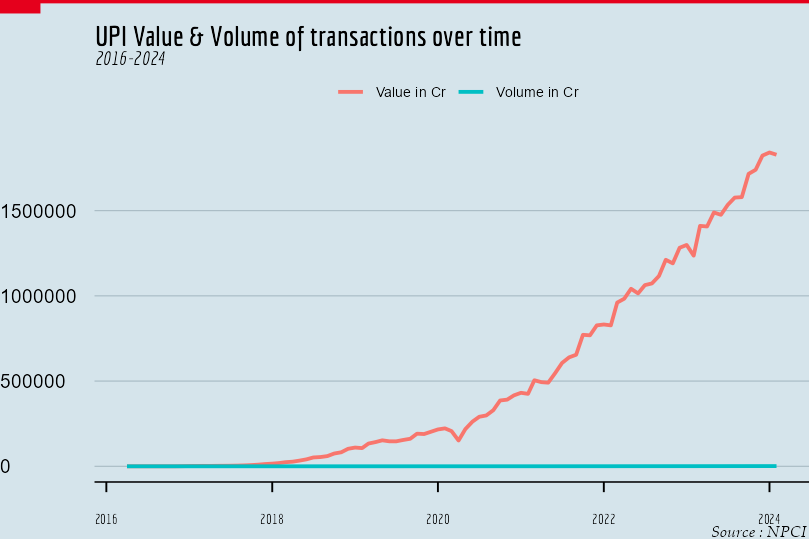
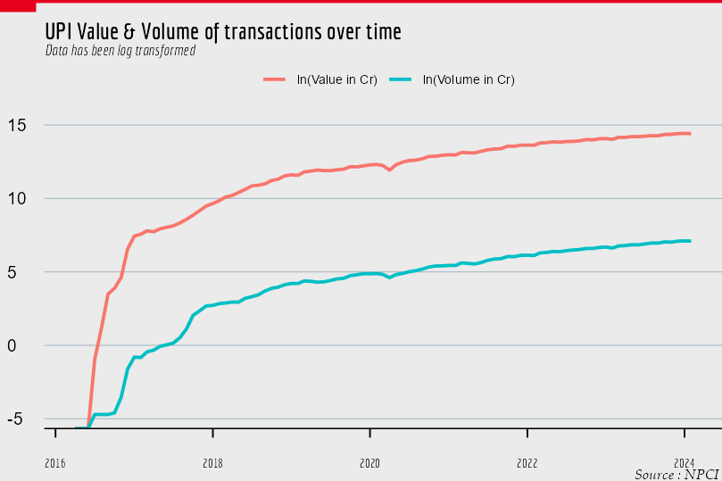

\newpage

```{=latex}
\setcounter{tocdepth}{2}
\tableofcontents
```
\newpage

```{r setup, include=FALSE}
knitr::opts_chunk$set(
	echo = FALSE,
	fig.align = "center",
	message = FALSE,
	warning = FALSE,
	cache = TRUE,
	dev = "ragg_png",
  dpi = 400,
	dev.args = list(png = list(type = "cairo")))
```

```{r echo=FALSE, error=FALSE, message=FALSE, warning=FALSE}
#Loading Essential Libraries####
library(randtests)
library(kableExtra)
library(broom)
library(dplyr)
library(xlsx)
library(ggplot2)
library(tseries)
library(ggspectra)
library(ggfortify)
library(gt)
library(gtExtras)
library(ggthemes)
library(tidyr)
library(prettydoc)
library(hrbrthemes)
library(knitr)
library(gridExtra)
library(ie2misc)
library(zoo)
library(xts)
library(grid)
library(sysfonts)
library(showtext)
sysfonts::font_add("Economica","C:\\Users\\Debaditya\\AppData\\Local\\Microsoft\\Windows\\Fonts\\Economica-Bold.ttf")
```

# Keywords {#sec-keywords .unnumbered style="color: gray;"}

```{r}
text_tbl <- data.frame(
Acronym = c("UPI", "PSP", "MSME","NEFT","RTGS","IMPS","Aeps","CTS","AR(p)","MA(q)","ARMA(p,q)","ARIMA(p,d,q)","SARIMA","AIC","MAPE"),
Definition = c("Unified Payment Interface,A fast and secure digitial pyment system","Payment Service Provider,can be a bank or other institution","Micro and Small & Medium Enterprises","National Electronic Funds Transfer is an electronic funds transfer system maintained by the Reserve Bank of India","Real-time gross settlement systems are specialist funds transfer systems where the transfer of money or securities takes place from one bank to any other bank","Immediate Payment Service (IMPS) is an instant interbank electronic fund transfer service through mobile phones.","Aadhaar Enabled Payment System (AePS) is a banking service developed by the National Payments Corporation of India(NPCI)."," Cheque Truncation System is an online image-based cheque clearing system","Autoregressive Process of order  p","Moving Average Process of order q","Combination of AR & MA process of order p and q ","A more complex version of ARMA where d represents the order of differencing","ARIMA model that implements Seasonality","Akaike Information Criterion is a mathematical method for evaluating how well a model fits the data it was generated from","Mean absolute percentage error,this measures the average magnitude of error produced by a model, or how far off predictions are on average")
)

kbl(text_tbl, booktabs = T) %>%
kable_styling(full_width = T,position = "center") %>%
column_spec(1, bold = T, color = "violet") %>%
column_spec(2, width = "30em") %>%
  kableExtra::kable_styling(latex_options = "hold_position")

```

\newpage

# **Abstract** {.unnumbered}

This paper presents a statistical analysis of the growth trajectory of the Unified Payments Interface (UPI) in India and explores its future prospects. UPI, introduced in April 2016 by the National Payments Corporation of India (NPCI), has rapidly transformed the landscape of digital payments in the country. The study begins by examining the evolution of UPI, highlighting key milestones and adoption trends since its inception. Utilizing available data sets, including transaction volumes, transaction amounts, merchant integration , user preference of UPI Apps etc . The paper offers insights into the exponential growth experienced by UPI over the years. Furthermore, it delves into a progressive comparison of UPI with other available online payment systems .All this is done using statistical methods like Descriptive Analysis, Time series analysis , Regression analysis , EDA(Exploratory Data Analysis) etc. The paper also discusses the future growth of UPI in different sectors via statistical methods of estimation. Finally, it concludes with the results about the different factors influencing the growth of UPI and remarks about different findings within the analysis. \newpage

# **Introduction** {.unnumbered}

The introduction of UPI has revolutionized the digital space. UPI usage has exponentially increased since its inception in 2016, with its growth outpacing all other modes of digital payments. UPI is an instant, real-time payment network built, owned, and operated by the National Payments Corporation of India (NPCI). This payment system is built as an inter-operable protocol and allows third-party vendors to build apps to provide payments as a service to all customers of participating banks. Due to interoperability, customers with an account in Bank "A" can use a payments app built by PSP "X" to send money from their account in one bank to self or other party accounts of any other bank or PSP participating in UPI via QR codes, mobile numbers, or other identifiers, with instant settlement of payments (NPCI, 2016). UPI is used by multiple stakeholders, including individuals, micro, small, and medium enterprises (MSMEs), and especially smaller merchants. It is easily accessible through mobile devices, provides convenient payment initiation methods, such as users registered mobile numbers, QR codes, etc., and ensures universal interperability between financial institutions. These design choices have helped enhance digital and financial literacy and included the portion of the population that was formerly underserved or unserved by financial institutions.

## Impact of UPI in India's Economy {.unnumbered}

In about eight years, India's indigenously developed UPI, has evolved into the default option to transact---from small ticket purchases at roadside shops to settling utility bills to restaurant bills, to now IPO stock purchases and mutual fund payments.

This transformation, which has now become a global template that many other countries are emulating, is founded on multiple edifices powered by a behavioural change among hundreds of millions.While UPI has made sending and receiving money at the tap of a mobile phone app, the bigger question is how has it added to India's broader economy? Importantly, what has been the specific incremental contribution of UPI or India's rapid digitalisation of payments to India's gross domestic product (GDP).The answer to this is two-fold. One is the opportunity cost. Two is through enabling easier credit-driven spending.

### Ease of Financial Access {.unnumbered}

UPI has had a profound impact on financial access in India by enhancing the ease and convenience of digital transactions, especially for those who were previously underserved by traditional banking services. Here are several ways UPI has contributed to improving financial access:

1.  **Accessibility**: UPI can be accessed through smartphones, making it available to a wide range of individuals, including those in remote areas where traditional banking infrastructure is limited.

2.  **Inclusion of Unbanked Population**: UPI has facilitated financial inclusion by allowing unbanked individuals to open a bank account digitally and link it to UPI, enabling them to participate in digital transactions.

3.  **Simplified Transactions**: UPI simplifies the process of making payments and transferring money, even for those with limited literacy or familiarity with banking procedures, thus lowering the barrier to entry for digital financial services.

### Digital Lending {.unnumbered}

Digital lending is one of the sections of fintech in India which has been positively impacted by UPI via streamlining the lending process and enabling more efficient disbursement of loans. UPI facilitates instant fund transfers, allowing digital lenders to disburse loans to borrowers quickly and efficiently. This speed is particularly beneficial for individuals in need of urgent funds, such as during emergencies or for time-sensitive expenses. UPI's seamless payment interface simplifies the loan repayment process for borrowers. UPI transactions are highly secure, utilizing two-factor authentication and encryption protocols to protect users' financial information. This enhanced security instills confidence among borrowers, \newpage

# Methodology {.unnumbered}

\newpage

# **Analyzing Monthly UPI Transaction(From 2016 to 2024)**
We first see the data head-
```{r echo=FALSE, message=FALSE}
#loading the dataset####
upi<-xlsx::read.xlsx(file = "C:\\Users\\Debaditya\\Documents\\Project_Work\\UPI_Analytics.xlsx" ,sheetIndex = 1)
#converting the dataset to a dataframe for ease#### 
upi<-as.data.frame(upi)
#reversing the order of rows since we want the data to begin from 2016-04####
data1<-as.data.frame(t(rev(as.data.frame(t(upi)))))
colnames(data1)<-c("Month","No. of Banks live on UPI","Volume(In Mn)","Value(In Cr)","Volume(In Cr)")
kable(head(data1,n = 20), "latex", longtable = T, booktabs = T,caption = "Monthly UPI Metrics") %>% kable_styling(latex_options = c("striped", "scale_down")) %>%
  kableExtra::kable_styling(latex_options = "hold_position") %>%
  kableExtra::kable_styling(latex_options = "hold_position")

```

Only the first 10 rows are shown for convenience.The volumes have been converted to crore from million.

```{r}
val_time<-ts(data=as.numeric(data1$`Value(In Cr)`),start = c(2016,4),end=c(2024,2),deltat = 1/12)
vol_time<-ts(data=as.numeric(data1$`Volume(In Cr)`),start = c(2016,4),end=c(2024,2),deltat = 1/12)
per_trans<-ts(data=val_time/vol_time,start = c(2016,4),end = c(2024,2),deltat=1/12)
bank_num<-ts(data=as.numeric(data1$`No. of Banks live on UPI`),start=c(2016,4),end=c(2024,2),deltat = 1/12)
```

## **Exploratory Analysis**



```{r echo=FALSE, warning=FALSE,eval=FALSE,fig.showtext=TRUE}

ggplot()+
  geom_line(data = upi,mapping = aes(x=upi$Month,y=upi$Value..in.Cr..,color="Value in Cr"),linewidth=1)+
  geom_line(data = upi,mapping = aes(x=upi$Month,y=upi$Volume..in.Cr..,color="Volume in Cr"),linewidth=1)+
  labs(x="Time",y="UPI Transaction amount & Volume in Cr",
       title="UPI Value & Volume of transactions over time",
       subtitle = "2016-2024",color="",caption = "Source : NPCI")+
  theme_economist()+
  theme(
    # Remove all grid lines
    panel.grid = element_blank(),
    # But add grid lines for the vertical axis, customizing color and size 
    panel.grid.major.y = element_line(color = "#A8BAC4", size = 0.3),
    # Remove tick marks on the vertical axis by setting their length to 0
    axis.ticks.length.y = unit(0, "mm"), 
    # But keep tick marks on horizontal axis
    axis.ticks.length.x = unit(2, "mm"),
    # Remove the title for both axes
    axis.title = element_blank(),
    # Only the bottom line of the vertical axis is painted in black
    axis.line.x.bottom = element_line(color = "black"),
    # But customize labels for the horizontal axis
    axis.text.x = element_text(family = "Economica", size = 8),
    legend.text = element_text(size=8),
    plot.caption = element_text(
      family = "Palatino Linotype", 
      face = "italic",
      size = 9,
      hjust = 0.995)
    
  )+
  theme(
    plot.title = element_text(
      family = "Economica", 
      face = "bold",
      size = 16
    ),
    plot.subtitle = element_text(
      family = "Economica",
      face="italic",
      size = 11,hjust = 0)
  )+
  theme(
    plot.margin = margin(0.04, 0, 0, 0, "npc")
  )
grid.lines(
  x = c(0, 1),
  y = 1,
  gp = gpar(col = "#e5001c", lwd = 5)
)

grid.rect(
  x = 0,
  y = 1,
  width = 0.05,
  height = 0.025,
  just = c("left", "top"),
  gp = gpar(fill = "#e5001c", lwd = 0)
)

```

As it can be seen the transaction amounts are much larger than the volume so it is not possible to contain them in the same graph and compare their growth simultaneously. To solve this problem we use the log transformation for both variables to bring them in a comparable range.

  

```{r echo=FALSE, message=FALSE, warning=FALSE,eval=FALSE,fig.showtext=TRUE}
library(grid)
font.add("Economica",regular = "C:\\Users\\Debaditya\\AppData\\Microsoft\\Windows\\Fonts\\Economica\\Economica-Regular.ttf")
ggplot()+
  geom_line(data = upi,mapping = aes(x=upi$Month,y=log(upi$Value..in.Cr..),color="ln(Value in Cr)"),linewidth=1)+
  geom_line(data = upi,mapping = aes(x=upi$Month,y=log(upi$Volume..in.Cr..),color="ln(Volume in Cr)"),linewidth=1)+
  labs(x="Time",y="UPI Transaction amount & Volume in Cr",title="UPI Value & Volume of transactions over time",subtitle = "Data has been log transformed",color="",caption = "Source : NPCI")+
  theme_economist()+
  theme(
    # Remove all grid lines
    panel.grid = element_blank(),
    # But add grid lines for the vertical axis, customizing color and size 
    panel.grid.major.y = element_line(color = "#A8BAC4", size = 0.3),
    # Remove tick marks on the vertical axis by setting their length to 0
    axis.ticks.length.y = unit(0, "mm"), 
    # But keep tick marks on horizontal axis
    axis.ticks.length.x = unit(2, "mm"),
    # Remove the title for both axes
    axis.title = element_blank(),
    # Only the bottom line of the vertical axis is painted in black
    axis.line.x.bottom = element_line(color = "black"),
    # But customize labels for the horizontal axis
    axis.text.x = element_text(family = "Economica", size = 8),
    legend.text = element_text(size=8),
  )+
  theme(
    plot.title = element_text(
      family = "Economica", 
      face = "bold",
      size = 15
    ),
    plot.subtitle = element_text(
      family = "Economica",
      face="italic",
      size = 10,hjust = 0
      
    )
  )+
  theme(
    plot.margin = margin(0.04, 0, 0, 0.01, "npc")
  )
grid.lines(
  x = c(0, 1),
  y = 1,
  gp = gpar(col = "#e5001c", lwd = 5)
)

grid.rect(
  x = 0,
  y = 1,
  width = 0.05,
  height = 0.025,
  just = c("left", "top"),
  gp = gpar(fill = "#e5001c", lwd = 0)
)


```

Now we can see the growth of both factors simultaneously and as we would've guessed the growth of UPI transaction volume and Transaction Amount is nearly identical even though the difference between their values is very high. This is due to the fact that each individual transaction results in some amount of money being transferred which can range from very small to very high values.It is hard to observe the presence of trend and seasonal components from this so we plot value and volume in separate plots.


```{r fig.cap="Value and Volume of transactions per month",fig.width= 10 ,fig.showtext=TRUE}
plot1<-ggplot()+
  geom_line(data = upi,mapping = aes(x=upi$Month,y=upi$Value..in.Cr..,color="Value in Cr"),linewidth=1)+
  labs(x="",
         y = "Value In Cr",
         color = "",title = "UPI Monthly Transaction Value ",subtitle = "2016-2024",caption = "Source : NPCI")+
  theme_economist()+
  theme(
    plot.title = element_text(
      family = "Economica", 
      face = "bold",
      size = 16
    ),
    plot.subtitle = element_text(
      family = "Economica",
      face="italic",
      size = 11,hjust = 0),
   axis.text.x = element_text(
     family = "Economica", 
     size = 8),
   plot.caption = element_text(
     family = "Economica", 
     size = 9),
   axis.title =element_text(
     family = "Economica", 
     size = 9),
  )

plot2<-ggplot()+
  geom_line(data = upi,mapping = aes(x=upi$Month,y=upi$Volume..in.Cr..,color="Volume in Cr"),linewidth=1)+scale_color_manual(values = "yellow3")+
  labs(x="",
         y = "Volume In Cr",
         color = "",title = "UPI Monthly Transaction Volume",subtitle = "2016-2024",caption = "Source :NPCI")+
  theme_economist(base_family = "Economica")+
  theme(
    plot.title = element_text(
      family = "Economica", 
      face = "bold",
      size = 16
    ),
    plot.subtitle = element_text(
      family = "Economica",
      face="italic",
      size = 11,hjust = 0),
   axis.text.x = element_text(
     family = "Economica", 
     size = 8),
   plot.caption = element_text(
     family = "Economica", 
     size = 9),
   axis.title =element_text(
     family = "Economica", 
     size = 9),
  )
grid.arrange(plot1, plot2, ncol=2)
```

The presence of a strong secular trend is visible with some random fluctuations in both of the plots. There isn't a very strong seasonal effect that can be identified from the plot,what should be noted duly is that the growth of UPI in terms of volume and value of transactions both have not been ~~linear~~ but rather have been very much exponential this information will help us in identifying a proper model for our analysis. We can also see the impact of *COVID-19* as there is a significant change in both metrics(Value & Volume) during the start of *COVID-19* pandemic .We can observe that since post pandemic the increase in value of transaction has been rapid , there might be an underlying effect of *inflation* in this which we may analyze ahead.  

```{r fig.cap="Plot of Average Transaction value",fig.showtext=TRUE}
regions <- tibble(x1 =as.Date("2016-04-01") , x2 = as.Date("2017-11-01"), y1 = -Inf, y2 = +Inf )
autoplot(per_trans,ts.fill = "blue4",ts.size =1)+
  theme_economist(base_size = 3,base_family = "Economica")+ 
  geom_rect(data = regions,
            inherit.aes = FALSE,
            mapping = aes(xmin = x1, xmax = x2,
                          ymin = y1, ymax = y2),
            color = "transparent",
            fill = "blue",
            alpha = .2)+
geom_vline(xintercept =as.Date("2017-11-01"),linetype="dashed",color="green")+
  labs(y="Amount Per Transaction in Rupee",title = "Average Transaction value per UPI transaction",caption = "Source : NPCI")+
  theme(
    plot.title = element_text(
      family = "Economica", 
      face = "bold",
      size = 16
    ),
    plot.subtitle = element_text(
      family = "Economica",
      face="italic",
      size = 11,hjust = 0),
   axis.text.x = element_text(
     family = "Economica", 
     size = 8),
   plot.caption = element_text(
     family = "Economica", 
     size = 9),
   axis.title =element_text(
     family = "Economica", 
     size = 9),
  )
```

From the plot we can see that the average transaction value between the period of initialization(2016) and upto 2018( *marked by blue area* )has been extremely *high* as during this initial period UPI was used by a selected few individuals. . Overtime with easier access of internet UPI started to become a mainstream method of payment and the average payment value stabilized near around 2019, Right now as the data shows the average transaction value per transaction is *decreasing slowly* this shows as time increases people are using UPI for more and more smaller transactions.

```{r fig.cap="Average transaction value post September 2018"}
#ggplot()+geom_boxplot(mapping=aes(y=per_trans),outlier.colour = "red")
per_trans_1<-ts(per_trans[25:95],start = c(2018,4),deltat=1/12)
autoplot(per_trans_1,ts.fill = "blue4",ts.size =1)+
  theme_economist(base_size = 6)+
  theme(
    plot.title = element_text(size = 10)
  )+
  labs(y="Amount Per Transaction in Rupee",title = "Average Transaction value per upi transaction(Post Sep- 2018)",caption = "Source : NPCI")+
  theme(
    plot.title = element_text(
      family = "Economica", 
      face = "bold",
      size = 16
    ),
    plot.subtitle = element_text(
      family = "Economica",
      face="italic",
      size = 11,hjust = 0),
   axis.text.x = element_text(
     family = "Economica", 
     size = 8),
   plot.caption = element_text(
     family = "Economica", 
     size = 9),
   axis.title =element_text(
     family = "Economica", 
     size = 9),
  )
```

In this period we can observe the average transaction value stabilizing around 1300-1500 and a slow decline can be seen as well. This time series might be of special interest as it is the only one so far which does not show a strong secular trend and there are no visible seasonal fluctuations as well but it does contain a significant amount of random fluctuation .It will be best to avoid the deterministic procedures for this time series so we will be analyzing this object only using stochastic analysis methods.  
```{r fig.cap="Number of Banks live in UPI"}
autoplot(bank_num,ts.fill = "green4",ts.size =1)+
  theme_economist(base_size = 6,base_family = "Economica")+
  labs(y="Number of Banks",title = "Number of Banks Live on UPI",subtitle = "2016-2024",caption = "Source : NPCI")+
  theme(
    plot.title = element_text(
      family = "Economica", 
      face = "bold",
      size = 16
    ),
    plot.subtitle = element_text(
      family = "Economica",
      face="italic",
      size = 11,hjust = 0),
   axis.text.x = element_text(
     family = "Economica", 
     size = 8),
   plot.caption = element_text(
     family = "Economica", 
     size = 9),
   axis.title =element_text(
     family = "Economica", 
     size = 9),
  )
```

Number banks allowing UPI registration is growing rapidly this indicates at the growth of financial inclusion among the population of India the more banks especially regional banks allow UPI registrations the better will be the penetration of digitization of payments throughout the country.

```{r echo=FALSE}
summ<-rbind(summary(val_time),summary(vol_time),summary(per_trans),summary(per_trans_1))
rownames(summ)<-c("Value","Volume","Avg. Transaction Val","Avg. Transaction Val(Post 2018 Sept)")
kable(summ,caption = "Summary Statistics for UPI Monthly Metrics")%>%
kable_styling(latex_options = c("striped", "scale_down")) %>%
  kableExtra::kable_styling(latex_options = "hold_position")
```

\pagebreak

## Time Series Analysis of Monthly UPI Metrics.

-   [Name Required] - Initially we may want to perform some classical methods such as smoothing procedures like Moving Average or filters to dampen the fluctuations and then proceed to decompose the time series into several components.After this we will move to stochastic models such as *AR*(Auto Regressive), *MA*(Moving Average) and if needed *ARMA*(Auto Regressive Moving Average Process) AND *ARIMA*(Auto Regressive Integrated Moving Average Process) given the condiitons to assume these models hold such as *stationarity* etc. We may also want to define invidual terms in our analysis as we move forward.

**Here we have 4 time series objects**

-   val_time:Value of UPI transactions per month (In Crore,Rupee)

-   vol_time:Volume of UPI transactions per month(In crore)

-   per trans:Average transaction amount per UPI transaction in each month(In rupee).

-   bank_num: Total number of registered banks on UPI.

### Analysing Time series with Trend and no Seasonal Variation(Monthly UPI Value & Volume of transaction)

From the exploratory analysis we found that that 2 of these time series 1.val_time 2.vol_time contained a significant amount of secular positive trend with some underlying random component,there is no visible seasonal fluctuation in these data.

**Trend**- From [@Kendall] "The concept of trend is more difficult to define. Generally, one thinks of it as a smooth broad motion of the system over a long term of years, but" long" in this connexion is a relative term, and what is long for one purpose may be short for another."\
The simplest type of trend is the familiar 'linear trend + noise', for which the observation at time t is a random variable $X_t$, given by $$X_t = \alpha + \beta_t + \varepsilon_t  .....(1)$$ where $\alpha$, $\beta$ are constants and $\epsilon_t$ denotes a random error term with zero mean. The mean level at time t is given by $$m_t = (\alpha + \beta_t)   .....(2)$$ this is sometimes called *'the trend term'*. Other writers prefer to describe the slope $\beta$ as the trend, so that trend is the change in the mean level per unit time.The trend in Equation (1) is a deterministic function of time and is sometimes called a *global linear trend*. In practice, this generally provides an unrealistic model, and nowadays there is more emphasis on models that allow for local linear trends.This could be done deterministically, but it is more common to assume that $\alpha$ and $\beta$ evolve stochastically giving rise to what is called a stochastic trend.So far the models considered have been linear,another possibility, depending on how the data look, is that the trend has a nonlinear form, such as quadratic growth.[@chatfield2016analysis]

-   **Filtering**- One of the most used procedure for dealing with a trend is to use a linear filter, which converts one time series, ${x_t}$into another ${y_t}$, by the linear operation

    $$
    y_t= \sum_{r=-q}^{+s}a_rx_{t+r}
    $$
where ${a_r}$ is a set of weights. In order to smooth out local fluctuations and estimate the local mean, we should clearly choose the weights so that $\sum{a_r}=1$, and then the operation is known as **Moving Average.** [@chatfield2016analysis]

There are many different choices for the weights of the moving average such as Spencer's 15 Point Moving average weights , Henderson's Moving average weights etc. We have a relatively smaller dataset so undertaking the end effects we may use the simple moving average with a 6 month order to smooth the data . This can be easily done using the `ma()` function in `stats` package .

```{r fig.width=10,fig.showtext=TRUE,fig.height=7 ,fig.cap="Moving Average Trend"}
library(forecast)
smth_val<-ma(val_time,order = 6)
smth_vol<-ma(vol_time,order = 6)

plot1<-autoplot(val_time,colour = "green",ts.size = 1)+geom_line(aes(y=smth_val,color="Moving Average"),size=1)+labs(x="Year",y="Value Of total Transactions",color="",title = "UPI Transaction value per month",subtitle = "Moving average superimposed")+theme_economist()+
  theme(
    plot.title = element_text(
      family = "Economica", 
      face = "bold",
      size = 16
    ),
    plot.subtitle = element_text(
      family = "Economica",
      face="italic",
      size = 11,hjust = 0),
   axis.text.x = element_text(
     family = "Economica", 
     size = 8),
   plot.caption = element_text(
     family = "Economica", 
     size = 9),
   axis.title =element_text(
     family = "Economica", 
     size = 9)
  )
plot2<-autoplot(vol_time,colour="blue",ts.size = 1)+geom_line(aes(y=smth_vol,color="Moving Average"),size=1)+labs(x="Year",y="Volume Of total Transactions",color="",title = "UPI Transaction volume per month",subtitle = "Moving average superimposed")+theme_economist()+
  theme(
    plot.title = element_text(
      family = "Economica", 
      face = "bold",
      size = 16
    ),
    plot.subtitle = element_text(
      family = "Economica",
      face="italic",
      size = 11,hjust = 0),
   axis.text.x = element_text(
     family = "Economica", 
     size = 8),
   plot.caption = element_text(
     family = "Economica", 
     size = 9),
   axis.title =element_text(
     family = "Economica", 
     size = 9)
  )
grid.arrange(plot1, plot2, ncol=2)
```

Both the plots are identical and we can observe that the moving average has successfully removed most of the random fluctuations within the series . If we consider our deterministic model to be $Y_t=T_t+e_t$ where $Y_t$,$T_t$ and $e_t$ represents the original series ,Trend component and the random component respectively then we can consider the moving Average value to be a good representative of the trend component.

Thus the calculated trend values are-
```{r}
xdc<-data.frame(seq.Date(as.Date("2016/4/1"),by="month",length.out = 95 ),smth_val,smth_vol)
colnames(xdc)<-c("Month","Smoothed Value","Smoothed Volume")
kable(xdc, "latex", longtable = T, booktabs = T)  %>%
kable_styling(latex_options = c("striped")) %>%
  kableExtra::kable_styling(latex_options = "hold_position")
```

The downside of this method is that it can not be used to make future prediction and also there's an effect of missing end values due to moving average. We can see that our estimated trend values are very close the original values which falls with our intial assumption that this time series is made up of trend and random error only. \newpage

-   **Curve Fitting**- While fitting a deterministic function of time as a curve we have to first figure what kind of a function might properly represent our time series. Everett Rogers in his book Diffusion of Innovations[-@rogers2003diffusion] mentions "The logistic function can be used to illustrate the progress of the diffusion of an innovation through its life cycle" ,historically, when new products are introduced there is an intense amount of research and development which leads to dramatic improvements in quality and reductions in cost. This leads to a period of rapid industry growth. Some of the more famous examples are: railroads, incandescent light bulbs, electrification, cars and air travel. Eventually, dramatic improvement and cost reduction opportunities are exhausted, the product or process are in widespread use with few remaining potential new customers, and markets become saturated. UPI is a modern innovation which has revolutionized the way payments are done it may be a good idea to fit a logistic growth curve to the monthly value and volume data for UPI transactions.\
    *The Logistic Function in terms of time is given as*- $$
    y_t=\frac{k}{1+\exp(\frac{b-t}{a})}
    $$ where $y_t$ is the value of the time series at time t and a , b , k are constants.

-   There are many different methods to fit a logistic curve to our data most of these include long calculations for our ease we will use the `SSlogis()` function from `stats` package along with the `nls()` function in R, `SSlogis()` employs a self starting logistic function using the input data(Period of time) and calculates constants k( *Asymptote* ), b( *point of inflexion* ) and a ( *Scaling constant*) , while `nls()` uses the model given by `SSlogis` to fit the data using non linear least squares.

Plotting the Calculated model-
```{r fig.cap="Fitting logistic curve to Monthly UPI value metric"}
#Creating Period instead of time observation
per1<-1:length(val_time)
#fitting the model
mod1<-nls(val_time~SSlogis(per1,k,b,a))
autoplot(val_time,ts.geom = 'point',ts.fill = "red",ts.shape =1)+
  geom_line(aes(y=predict(mod1),color="Fitted Line"),linewidth=1)+
  scale_color_manual(values = "green")+
  labs(color="",title = 'Logistic curve fit to Monthly UPI value metric',x="",y="")+
  theme_ft_rc()+theme(plot.title = element_text(size = 12,hjust=0))
```

From the fitted model we can see that our model choice was correct as the data seems to be very close to the fitted line. We can see the estimated values for the constants as -

```{r}
kable(tidy(mod1),format = 'pipe',caption = "Estimates for Logistic Fit")%>%
kable_styling(position = "center") %>%
  kableExtra::kable_styling(latex_options = "hold_position")
```

from this the calculated equation becomes -

$$
y_t=\frac{2.436074e+06}{1+\exp(\frac{7.974670e+01 - t}{1.408733e+01})}
$$

based on the equation the fitted values are

```{r}

xdc<-data.frame(seq.Date(as.Date("2016/4/1"),by="month",length.out = length(val_time) ),val_time,predict(mod1))
colnames(xdc)<-c("Time","Original Value","Fitted Value")
kable(xdc, "latex", longtable = T, booktabs = T,caption = "Logistic Curve fit for UPI Monthly Transaction Value")  %>%
kable_styling(latex_options = c("striped"),position = "center") %>%
  kableExtra::kable_styling(latex_options = "hold_position")

```

Based on this curve fitting the future estimates for the next 12 months will be

```{r}
new <- data.frame(per1=96:107)
newf<-data.frame(seq.Date(as.Date("2024/3/1"),length.out = 12,by="month"),(predict(mod1,newdata =new)))
kable(newf,col.names = c("Month","Predicted Value"),caption = "Prediction for Monthly Values")%>%kable_styling(latex_options = c("striped"),position = "center") %>%
  kableExtra::kable_styling(latex_options = "hold_position")
```
We can apply the similar methods for transaction volume which gives us -
```{r fig.cap="Logistic curve fit to Monthly UPI volume metric"}
#Creating Period instead of time observation
per2<-1:length(vol_time)
#fitting the model
mod2<-nls(vol_time~SSlogis(per2,k,b,a))
autoplot(vol_time,ts.geom = 'point',ts.fill = "brown",ts.shape =1)+
  geom_line(aes(y=predict(mod2),color="Fitted Line"),linewidth=1)+
  scale_color_manual(values = "blue")+
  labs(color="",x="",y="",title = 'Logistic curve fit to Monthly UPI volume metric')+
  theme_ft_rc(plot_title_margin = 25,plot_margin = margin(20,30,10,20) )+
  theme(plot.title = element_text(size = 12,family = "Economica"),
        legend.position = "bottom")
```

```{r}
kable(tidy(mod2),format = 'pipe',caption = "Estimates from Logistic -Curve Fit for Volume")%>%kable_styling(position = "center") %>%
  kableExtra::kable_styling(latex_options = "hold_position")
```

from this the calculated equation becomes -

$$
y_t=\frac{2006.45018}{1+\exp(\frac{ 88.00355 - t}{14.83489})}
$$

based on the equation the fitted values are

```{r}

xdc<-data.frame(seq.Date(as.Date("2016/4/1"),by="month",length.out = length(vol_time) ),vol_time,predict(mod2))
colnames(xdc)<-c("Time","Original Volume","Fitted Volume")

kable(xdc, "latex", longtable = T, booktabs = T,caption = "Logistic Curve fit for UPI Monthly Transaction Volume")  %>% kable_styling(latex_options = c("striped"),position = "center")%>%kableExtra::kable_styling(latex_options = "hold_position") 
```

Based on this curve fitting the future estimates for the next 12 months will be-

```{r}
new <- data.frame(per2=96:107)
newf<-data.frame(seq.Date(as.Date("2024/3/1"),length.out = 12,by="month"),(predict(mod2,newdata =new)))
kable(newf,col.names = c("Month","Predicted Value"),caption = "Prediction for Monthly UPI Volume of Transaction")%>%kable_styling(latex_options = c("striped"),position = "center") %>%
  kableExtra::kable_styling(latex_options = "hold_position")
```

A plot with the future estimates looks something like this -

```{r}
new <- data.frame(per2=1:107)
date1<-seq.Date(as.Date("2016/4/1"),by="month",length.out = length(vol_time) )
date2<-seq.Date(as.Date("2016/4/1"),by="month",length.out = 107 )

ggplot()+
geom_line(aes(x=date2,y=predict(mod2,newdata = new),color="Fitted Line"),linewidth=1,linetype="dashed")+
  scale_color_manual(values = "green")+
  geom_point(aes(x=date1,y=vol_time))+
  labs(x="",y="",color="",title = 'Forecast based on logistic curve for Monthly\nUPI value metric')+
  theme_ft_rc()+theme(plot.title = element_text(size = 11))
```

A long term prediction for both value and volume can be given via a plot as -

```{r fig.width=10,fig.height=9 ,fig.width=8}
new1 <- data.frame(per1=1:131)
date11<-seq.Date(as.Date("2016/4/1"),by="month",length.out = length(val_time) )
date21<-seq.Date(as.Date("2016/4/1"),by="month",length.out = 131)
plot1<-ggplot()+
geom_line(aes(x=date21,y=predict(mod1,newdata = new1),color="Fitted Line"),linewidth=1)+
  scale_color_manual(values = "green")+
  geom_point(aes(x=date11,y=val_time))+
  labs(color="",title = 'Forecast based on logistic curve for \nMonthly UPI value metric',x="",y="")+
  theme_ft_rc()+theme(plot.title = element_text(size = 12))
date12<-seq.Date(as.Date("2016/4/1"),by="month",length.out = length(vol_time) )
date22<-seq.Date(as.Date("2016/4/1"),by="month",length.out = 131)
new2 <- data.frame(per2=1:131)
plot2<-ggplot()+
geom_line(aes(x=date22,y=predict(mod2,newdata = new2),color="Fitted Line"),linewidth=1)+
  scale_color_manual(values = "green")+
  geom_point(aes(x=date12,y=vol_time))+
  labs(color="",title = 'Forecast based on logistic curve for \nMonthly UPI volume metric',x="",y="")+
  theme_ft_rc()+theme(plot.title = element_text(size = 12))
grid.arrange(plot1, plot2, nrow=2)
```

Since our assumed model is non linear $R^2$ is not suitable as a model adequacy checker,to overcome this we may check the residuals via a normal qqplot

```{r}
qqnorm(residuals(mod1),main = "Normal Q-Q Plot For logistic fit")
qqline(residuals(mod1))
```

The residuals are very much linear and seem to be close to a standard normal variate.We can conclude that our model fit seems to be decent.

#### Foundings- {.unnumbered}

-   We find that by the year 2025 Volume of monthly transactions will cross 1500 crores and value of monthly transactions will cross 2000000 crores.
-   We can also expect that by the year 2027 both of these metrics will start to stabilize, although this is dependent on many other factors which we have not considered in our study these include avaliability of smartphones and fast internet connection for the percentage of population. But never the less this is a expectable figure.

\newpage

## Stochastic Analysis of monthly Per Transaction Value

Previously From the EDA we found that the monthly per transaction value is decreasing with time , we also found that this data was visually stationary if we ignore the initial instability.For forecasting and analysis of this time series we first plot the time series along with its ACF and PACF.

```{r fig.showtext=TRUE ,fig.dim=c(4,5)}
window(per_trans,start=2018)%>%ggtsdisplay(main="Monthly Per Transaction Value(In Rupee)",theme = theme_bw(base_family = "Economica"))
window(per_trans,start=2018)%>%diff(1)%>%ggtsdisplay(main="Differenced at Lag 1",theme = theme_bw(base_family = "Economica"))

```

We can see that the ACF has cut off lag at 1 and the PACF has a significant value in lag 1. Post differencing there are no significant autocorrelation values for the time series. Assuming our time series does not contain any seasonal effect we can define our differenced time series as a random walk model.\
$$
y_t=y_{t-1}+\varepsilon_t
$$ Which in ARIMA terms is written as ARIMA(0,1,0). We now check the `auto.arima()` output and see if our intuition about the model is correct.

```{r}

#window(per_trans,start=2018)%>%Arima(order=c(1,0,1))%>%accuracy()
kkk<-window(per_trans,start=2018)%>%auto.arima(seasonal = FALSE)
kkk
kable(accuracy(kkk),caption = "Accuracy Measures for ARIMA(0,1,0) fit") %>%
  kableExtra::kable_styling(latex_options = "hold_position")
```

We can see that the MAPE value is less than 10 which usually implies a very good model fit. Also since our data does not contains zero values MAPE is actually a good model accuracy indicator. We now plot the forecast using this ARIMA(0,1,0) model

```{r}
forecast(kkk,15)%>%plot()
forecast(kkk,15)%>%kable(caption = "Forecasts from ARIMA(0,1,0)") %>%
  kableExtra::kable_styling(latex_options = "hold_position")
```

we can see that the predicted forecast is constant in fact it is equal to the last observation. This is due to the fact that for random walks only naive predictions are possible since they do not contain any significant pattern as such. We may plot some other forecasts like Simple Exponential Smoothing and Holt-Winters Exponential Smoothing.

```{r fig.height=6}
kkkk<-ses(window(per_trans,start=2018))
kkl<-HoltWinters(window(per_trans,start=2018))
kkk2<-forecast(kkkk,12)
kkk3<-forecast(kkl,12)
par(mfrow=c(2,1))
plot(kkk2,type="o",col="orange")
grid()
plot(kkk3,type = "o",col="orange")
grid()

```

As it can be seen SES gives us a naive constant forecast which is the same as the ARIMA forecast. Holt-Winters on the other hand gives us a rather interesting looking prediction, the predicted values are given as -

```{r}
kable(kkk3,caption="Forecasts from Holt-Winters Exponential Smoothing") %>%
kable_styling(latex_options = c("striped"),position = "center") %>%
  kableExtra::kable_styling(latex_options = "hold_position")

```

Here is the accuracy measure for this model.

```{r}
kable(accuracy(kkk3),caption = "Accuracy Measures for Holt-Winters Method") %>%
  kableExtra::kable_styling(latex_options = "hold_position")

```

#### Foundings {.unnumbered}

-   We have found that per transaction value is decreasing with time, and as we can assume this value will constantly decrease to e certain point after which this will stabilize.This data is very important as it tells us about the user patterns of UPI users and how it has changed through the years. UPI is constantly being used for more lower worth transactions which means it is getting even more implemented to our daily life, it is becoming a decent substitute for cash and is increasing financial inclusivity among people. The ease of UPI transactions also is very helpful towards MSME's and this is a good opportunity for them to use this information and use UPI specific offers to attract more customers.

## Analyzing monthly growth rate for transaction volume.

We first calculate the monthly growth rate relative to the past month with the help of a simple function.

```{r echo=TRUE}
#Calculating growth rate####
dat<-list()
#This Function Calculates the growth rate#
month_growth<-
  function(data,returndat)
  {
    returndat[1]=0;
    for(i in 2:length(data)){
      if(data[i-1]>0)
      {
        returndat[i]=(((data[i]-data[i-1])/data[i-1])*100)
      }
      else if(data[i-1]==0)
        returndat[i]=0
    }
    returndat
  }
growth<-matrix(month_growth(as.numeric(data1$`Volume(In Cr)`),dat),ncol=1)
growth<-data.frame(as.numeric(growth))
colnames(growth)<-c("GrowthRate")
```

The function calculates the monthly growth rate relative to the previous month.

```{r}
growth1<-zoo(growth,as.yearmon(data1$Month))
autoplot(growth1,ts.fill = "red")+
labs(title="Plot of Monthly growth rate for\n UPI transaction Volume ",y="Growth Rate%",x="Year",subtitle = "2016-2024")+
  theme_ft_rc()+theme(axis.title.x = element_text(hjust = 0.5),axis.title.y = element_text(hjust = 0.5),plot.title = element_text(size=11))


```

Here is the first few rows of the growth rate-

```{r}
kable(head(as.data.frame(growth1)),caption = "Monthly Growth Rate for UPI Volume of Transaction") %>%
kable_styling(latex_options = c("striped"),position = "center") %>%
  kableExtra::kable_styling(latex_options = "hold_position")
```

and here are the last few rows-

```{r}
kable(tail(as.data.frame(growth1)),caption = "Monthly Growth Rate for UPI Volume of Transaction") %>%
kable_styling(latex_options = c("striped"),position = "center") %>%
  kableExtra::kable_styling(latex_options = "hold_position")
```

Plotting this monthly growth rate we see the initial values are very high so we are not able to properly visualize the change, assuming these to be outlier since it is expected that initial growth rate will be very high we may ignore these values and re-plot the values excluding the first few observations.

```{r}
growth2<-window(growth1,start = 2018)
autoplot(growth2)+labs(title="Plot of Monthly growth rate for UPI transaction Volume ",subtitle = "2018-2024",y="Growth Rate%",x="Year")+theme_ft_rc(axis = T)+theme(axis.title.x = element_text(hjust = 0.5),axis.title.y = element_text(hjust = 0.5),line = element_line(color = "white",linetype = "dashed"),plot.title = element_text(size = 12))
```

Visually the data looks kind of stationary , to confirm our assumption we may use **Augmented Dickey Fueller** Test to look for unit roots and find if the data is truly stationary or not and also find the lag order. We assume the significance level to be 0.05.

```{r warning=TRUE}
kable(tidy(adf.test(growth1)),caption = "ADF-Test Results") %>%
  kableExtra::kable_styling(latex_options = "hold_position")
```

We can observe that the p value for the test is less than our assumed significance level of 0.05 .So we may reject the null hypothesis and conclude that our data is stationary.

We may also analyze the Autocorrelation for this time series -

```{r}
Acf(growth2)
```

from the plot we find the that the process acf is identical to a **white noise** process.We can make some short term predictions for the monthly growth rate using a **Simple Exponential Smoothing** forecast we do this using the `ses()` function in `forecast` package.

```{r}
growthforc<-HoltWinters(growth2)
temp1<-forecast(growthforc,h = 6)
temp2<-ses(growth2,h=6)
autoplot(temp2) +
autolayer(fitted(temp2), series="Fitted") +
ylab("Growth Rate(%)") + xlab("Year")+theme_ft_rc()+theme(axis.title.x = element_text(hjust = 0.5),axis.title.y = element_text(hjust = 0.5),line = element_line(color = "white",linetype = "dashed"),plot.title = element_text(size = 12,hjust = 0))
```

We can see that the forecast model is naive and the fit isn't very identical. The forecasts for future growth rate are given around 5% positive growth for the next months. This is a simple and naive forecast so it won't be absolutely perfect.But it does give us some idea.

```{r}
kable(round(accuracy(temp2),digits = 2),caption = "Accuracy Measure for Holt-Winters")%>%kableExtra::kable_styling(latex_options = "hold_position")
```

We can see that the accuracy measures aren't very satisfactory as well. We may use the `HoltWinters()` function to apply the *Holt-Winters Exponential* smoothing for a better forecast.

```{r}
autoplot(temp1) +
  autolayer(fitted(temp1), series="Fitted") +
  ylab("Growth Rate(%)") + xlab("Year")+theme_ft_rc()+theme(axis.title.x = element_text(hjust = 0.5),axis.title.y = element_text(hjust = 0.5),line = element_line(color = "white",linetype = "dashed"),plot.title = element_text(size = 12))
```

We can see that the forecast lags a little behind the values at certain points within the sample.Outside the sample the prediction are given near 15% for the next month with values dropping and staying around 5% to 8% positive growth.

\newpage

# Analysing Daily UPI transactions(2016-2018)

This data has been collected from RBI daily payment system indicators.This data is daily updated by RBI and is provided in the form of a excel workbook with multiple sheets where each sheet contains data about every months data from 2020 to the most latest data available. The data was in a format with multiple sub-columns within each column ,`R` isn't well suited for handling this kind of data so first a power query was run through the excel file to combine multiple sheets into a single sheet . The original file contained more columns and data about other digital payment metrics as well but since these data were added in different intervals of time i had to scrap some of them.Some of the columns contain 0 values these are bank dependent payment methods so they are turned off during bank holidays( some Saturday's and Sunday's and other bank holidays ) .

### Issues in Analysing Daily Data {.unnumbered}

Before the beginning of this analysis a few points need to be noted - Analysing daily data is extremely tedious especially on a very high frequency since multiple different factors come into play here such as multiple seasonality, effects of holiday, outlier effects, specific real time events that have impact on the data etc.Due to these model selection becomes extremely hard and as we will see this is an issue i have faced while doing this part of the project ,Due to my lack of knowledge of certain complex time series models which could've better explained or forecasted this data ,i couldn't use them. I have done my very best to do this analysis in a way that has minimal errors.

## Exploratory Data Analysis

The first few rows of the dataset is --

```{r}
#Loading the data 
settle1<-read.xlsx(file="C:\\Users\\Debaditya\\Documents\\Project_Work\\Settle_Data_Full_Final.xlsx",sheetIndex = 1,as.data.frame = 1)
settle12<-settle1[,c("Date","UPI_Vol","RTGS_Vol","NEFT_Vol","IMPS_Vol","AePS_Vol","CTS_Vol")]
#Showing the data
kable(head(settle12,n = 20), "latex", longtable = T, booktabs = T)  %>%
kable_styling(latex_options = c("striped", "scale_down")) %>%
  kableExtra::kable_styling(latex_options = "hold_position")
```

We now plot the daily UPI transaction volume

```{r}
settle2<-data.frame(settle1$Date,settle1$UPI_Vol,settle1$IMPS_Vol)
colnames(settle2)<-c("Date","UPI_Vol","IMPS_Vol")

settletime1<-xts(settle1[,-1],settle1[,1])
settletime2<-xts(settle2[,-1],settle2[,1])
#Plotting
main <- "Daily UPI Transaction volume(In Mn)"
plot(settletime1$UPI_Vol, main = main,
  legend.loc = "topleft",col = "darkblue"
)
```

We can see that there is some kind of repeating pattern within the data , this is new to us since the monthly data we worked with earlier did not show any kind of seasonality or cyclic behavior,From further inspection we can see this is due to the fact that the patterns appear within the monthly period, We can zoom to a specific portion of the graph to clearly analyze the pattern.

```{r}
plot(window(settletime1$UPI_Vol,start = "2023-01-15",end="2023-08-15"),main="Daily UPI Transaction Volume\nBetween March 15th 2023 and August 15th 2023",col = "orange3",bg = "white",yaxis.right = F,grid.ticks.lty = 3)
```

We can see from the plot that at the beginning of each month the transaction volume achieves its maximum value,this value gradually decreases over the month and another peak is acheieved at the start of the next month, This is a monthly seasonal component. We can also see that this seasonal component is increasing with trend so a multiplicative decomposition should be considered while decomposing the data.

### Decomposition 

The main problem with decomposing a daily time series is that monthly seasonal patterns are hard to catch since their period of occurrence although is technically seasonal but is irregular patterns since all months don't have the same number of days. So we may perform a decomposition based on an assumed model of - $$
Data=Season_m*Season_y*Trend*Error
$$ where $Season_m$ &$Season_y$ are monthly and yearly seasonality respectively. Since our data is daily so classical decomposition fails since classical decomposition is unable to catch seasonality within the months.To overcome this issue we use the **STL** decomposition method, here STL stands for “Seasonal and Trend decomposition using LOESS(locally estimated scatterplot smoothing)” ,This method was developed by R. B. Cleveland et al. [@cleveland90].STL has several advantages over the classical decomposition, such as it considers multiple seasonal components, it allows the seasonal component to change with time unlike the classical method.

```{r}
library(feasts)
library(tsbox)
df <- tsbox::ts_tsibble(settletime1$UPI_Vol)
decomp <- df %>% model(STL(log(value)~season(period=1)+season(period=30))) %>% components()
decomp %>% autoplot()+theme_bw(base_family = "Economica")+labs(title = "STL Decomposition")
((decomp$remainder))%>%plot(type = "l",x=decomp$time)
#per1<-1:length(upi_vol)
#upi_vol<-ts(settletime1$UPI_Vol)
#mod1<-nls(upi_vol~SSlogis(per1,k,c,a))
#autoplot(upi_vol,ts.geom = 'point',ts.fill = "red",ts.shape =1)+
# geom_line(aes(y=predict(mod1),color="Fitted Line"),linewidth=1)+
#  scale_color_manual(values = "green")+
#  labs(color="",title = '',x="",y="")+
#  theme_ft_rc()+theme(plot.title = element_text(size = 12,hjust=0))

```

We can see from the decomposition plot that the seasonal component is increasing with time,the trend component is fairly smooth and shows a upward growth as we saw in our monthly data.The seasonality shows an increasing trend towards the end of the year this can be attributed to increase in festivities during the later part of the Year . The remainders are fairly consistent as can be seen in the qqplot below-

```{r}
acf(decomp$remainder)
qqnorm(decomp$remainder)
qqline(decomp$remainder)
```

This implies that our selection of the decomposition model is decent.

A sample of The decomposed data is given as -

```{r}
kable(tail(decomp[,-1],n = 30), "latex", longtable = T, booktabs = T,caption = "Decomposition of Daily UPI Volume of Transactions ") %>%kable_styling(latex_options = c("striped"),position = "center") %>% kableExtra::kable_styling(latex_options = "hold_position")
```

\newpage

## Stochastic Modelling

So far we have rarely used any stochastic models to analyze our dataset we now move to a more sophisticated analysis and forecast using Stochastic Models like **AR** ,**MA**,**ARMA**,**ARIMA** &**SARIMA** . We first plot the Auto Correlation function and the Partial Autocorrelation Function to see if we can identify the process.

```{r fig.width=7}
par(mfrow=c(1,2))
Acf(settletime1$UPI_Vol,main="ACF of Daily Time Series")
Pacf(settletime1$UPI_Vol,main="PACF of Daily Time Series",col="orange")
```

#### Interpretation of ACF & PACF- {.unnumbered}
1.  **ACF**- The ACF shows significant autocorrelations at all lags, slowly decreasing. This pattern is characteristic of a non-stationary series, typically one that might be differenced to achieve stationarity.
2.  **PACF** - The PACF has a significant spike at lag 1 and then cuts off quickly, with the subsequent lags being mostly within the confidence intervals. This suggests that the time series might follow an autoregressive process of order 1 - $AR(1)$.\
    Using the `auto.arima()` function from the `forecast` package we can find the optimal ARIMA model based on the lowest AIC values.This function is based on the Hyndman-Khandakar algorithm.[@JSSv027i03]

### ARIMA Modeling -

We fit the data to the best possible ARIMA model using the `auto.arima()` function The Summary of the fitted model is given as -

```{r fig.showtext=TRUE}

tempk<-auto.arima(settletime1$UPI_Vol,trace = TRUE)
summ<-summary(tempk)
summ$series<-"UPI Volume of Daily Transactions"
summ
```
We plot the forecasts for the next 30 days-
```{r}
forecast(tempk,30)%>%plot
```

We can see that our chosen model is ARIMA(1,1,2), this is a non seasonal model, but our data definitely has some seasonal pattern within it , so the model chosen through `auto.arima()` isn't really ideal this time.We can check the residuals from the model to see if this is true.

```{r fig.width=9 , fig.showtext=TRUE}
checkresiduals(tempk)
```

We can see that the residuals are not random and there are significant auto-correlation at different lags. The Ljung-Box Test P-Value is also very very low indicating non-randomness.To overcome this issue we may try using the seasonal adjusted data from our STL decomposition and use it for forecasting.

# Payment Category Analysis -

In this section we analyse how the 3 different payment categories under person to person and person to merchant payments have seen changes through the time, The three payment categories are-  
1. Less Than 500
2. Greter than 500 but less than 2000
3. Greater than 2000

The dataset is too large to show in a page a link to the data is given[here](https://github.com/niceGriffith/UPI_Analysis/blob/main/Data_Non_Scraped/UPI_P2P_P2M.xlsx)
```{r}
dat<-read.xlsx(file ="C:\\Users\\Debaditya\\Documents\\Project_Work\\UPI_P2P_P2M.xlsx"
          ,sheetIndex = 1,as.data.frame = 1)
```

## EDA
We Plot the the transaction volumes in different payment categories as fraction of total volume of transaction instead of the raw values.

```{r}
freq_val_p2p<-(dat[9:11]/dat$Vol_total)*100
freq_val_p2m<-(dat[13:15]/dat$Vol_total)*100
ggplot()+
  geom_line(mapping = aes(y=freq_val_p2p$P2P_LE_500_VOL,x=dat$Month,color="<500_P2P"),cex=1.2)+ geom_point(mapping = aes(y=freq_val_p2p$P2P_LE_500_VOL,x=dat$Month),cex=1.3,color="yellow")+
geom_line(mapping = aes(y=freq_val_p2p$P2P_501_2000_VOL,x=dat$Month,color="500-2000_P2P"),cex=1.2)+
geom_point(mapping = aes(y=freq_val_p2p$P2P_501_2000_VOL,x=dat$Month),cex=1.3,color="violet")+
geom_line(mapping = aes(y=freq_val_p2p$P2P_GE_2000_VOL,x=dat$Month,color=">2000_P2P"),cex=1.2)+geom_point(mapping = aes(y=freq_val_p2p$P2P_GE_2000_VOL,x=dat$Month),cex=1.3,color="cyan")+
  geom_line(mapping = aes(y=freq_val_p2m$P2M_LE_500_VOL,x=dat$Month,color="<500_P2M"),cex=1.2)+
  geom_point(mapping = aes(y=freq_val_p2m$P2M_LE_500_VOL,x=dat$Month),cex=1.3,color="pink")+
  geom_line(mapping = aes(y=freq_val_p2m$P2M_501_2000_VOL,x=dat$Month,color="500-2000_P2M"),cex=1.2)+
  geom_point(mapping = aes(y=freq_val_p2m$P2M_501_2000_VOL,x=dat$Month),cex=1.3,color="lightblue")+
geom_line(mapping = aes(y=freq_val_p2m$P2M_GE_2000_VOL,x=dat$Month,color=">2000_P2M"),cex=1.2)+geom_point(mapping = aes(y=freq_val_p2m$P2M_GE_2000_VOL,x=dat$Month),cex=1.3,color="green")+
theme_ft_rc()+
  theme(
    legend.text = element_text(family = "Economica"),
    legend.title = element_text(family = "Economica"),
    panel.grid = element_line(linetype = "dashed",colour = "yellow"),
    axis.line = element_line(colour = "gray"),
    axis.text = element_text(colour = "gray",family = "Economica"),
    axis.title.x = element_text(colour = "gray",family = "Economica",hjust=0.5,size = 12),
    axis.title.y = element_text(colour = "gray",family = "Economica",hjust=0.5,size = 12),
    plot.title = element_text(colour = "cyan",hjust=0,face ="bold",family="Economica",size=15),
    plot.subtitle = element_text(colour = "cyan",hjust=0,family = "Economica",face = "bold",size=8),
    plot.caption = element_text(family = "Economica"))+
  labs(color="Payment Category",title="Category Wise payment over time ",
       subtitle = "in fractions of total payment volume",x="Time",y="Frequency",
       caption = "Source: NPCI")

```

We can see that except the less than 500 category of person to person and person to merchant payments the other categories have not shown any significant changes throughout this period,we can see that while less than 500 person to person payments are decreasing peson to merchant are increasing in a quite inverse proportion.There is a slight change in  greater than 2000 person to person and (500-2000) person to person payments as we can see there is a downward trend for both of them.

```{r}
freq_val_p2p<-(dat[9:11]/dat$Vol_total)*100
p2p_tot<-((dat[9:11]))
p2p_tot<-p2p_tot[,1]+p2p_tot[,2]+p2p_tot[,3]

freq_val_p2m<-(dat[13:15]/dat$Vol_total)*100
p2m_tot<-dat[,16]
freq_tot<-data.frame(dat$Month,(p2m_tot/dat$Vol_total)*100,(p2p_tot/dat$Vol_total)*100)
colnames(freq_tot)<-c("dates","P2M","P2P")

###Area Chart
library(viridis)
freq_tot %>% 
  mutate(dates = as.Date(dates)) %>% 
  gather(variable, value, c("P2M","P2P")) %>% 
  ggplot(aes(x = dates, y = value, fill = variable)) +
  geom_area(alpha=0.6 , size=.5, colour="white")+ 
  scale_x_date(expand = c(0, 0)) +
  scale_y_continuous(expand = c(0, 0)) +
  scale_fill_viridis(discrete = T,option = "D") +
  theme_ipsum(plot_title_margin = 20,plot_title_face = "bold") + labs(x="",y="Percentage Share")+
  theme(
    legend.text = element_text(family = "Economica"),
    legend.title = element_blank(),
    legend.position = "bottom",
    panel.grid = element_line(linetype = "dashed",colour = "yellow"),
    axis.text= element_text(colour = "black",family = "Economica",size=10),
    axis.text.x = element_text(margin = margin(10,20,20,20)),
    axis.title.x = element_text(colour = "black",family = "Economica",hjust=0.5,size = 11),
    axis.title.y = element_text(colour = "black",family = "Economica",hjust=0.5,size = 15),
    plot.title = element_text(colour = "black",hjust=0.5,face ="bold",family="Economica",size=18),
    plot.subtitle = element_text(colour = "grey50",hjust=0.5,family = "Economica",face = "bold",size=12),
    plot.caption = element_text(family = "Economica",hjust=0.5),
    plot.margin = margin(15,15,15,15))+
  ggtitle("The Race between P2P AND P2M",subtitle = "2022-2024")
```
From the plot we can see that over time P2M(Person to Merchant) payments have overtaken P2P(Person to Person) payments , this indicates the widescale acceptance of UPI by merchants throughout india. In a country where a substantial number of people and businessmen are skeptical about digital payments this is a remarkable achievement since this implies a growing trust towards UPI and a much wider acceptance.

